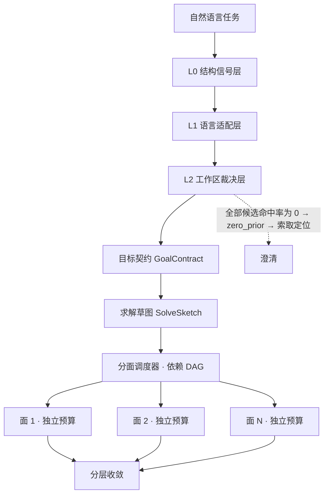

# Agent 目标问题求解机制 V5：通用求解内核与分面调度

> 状态：提案 · 待评审（决策点 D1–D5 已裁定，见 §5）
> 前序：`AGENT_GOAL_SOLVING_MECHANISM_V4.md`

## 1. 结论

V4 解决了"控制面统一"——把意图分类、阶段推进、工作项状态收敛为单一证据驱动状态机。它消除了"目标是修复却走核验流程"这类错位。但 V4 之后暴露的问题不在控制面，而在**求解能力与任务复杂度不匹配**：

- 计划是**静态模板**（5 种模式靠关键词匹配），不是针对任务生成的；
- 多个交付面**共享同一份线性状态机与预算**，前面的面会把后面的面饿死；
- 收敛判据**只有 shell 一条路**，大量任务类型永远到不了 `Verified`；
- 领域知识**硬编码在词表里**，换个语言或换个项目就失效。

前三条导致"能做但做不完"，第四条导致"换个项目就不会做"。

**V5 的核心改造有两层：**

1. **机制通用化**——建立三层可插拔内核：结构信号层（零配置、跨语言跨领域）→ 语言适配层（自动检测）→ 领域画像层（**由工作区反馈自动裁决，非人工词表**）。任何一层缺失，系统都能降级工作而不是失效。
2. **求解分面化**——计划由静态模板升级为任务特化的求解草图（带依赖的交付面 DAG），每个面持有独立的阶段、预算与收敛判据；按依赖 DAG 全并行推进。

**设计第一原则：机制不得依赖任何具体项目、语言或业务概念。** 任何在项目 A 上有效的能力，在项目 B 上必须同样有效；项目特有的知识只能以"可选增强"的方式注入，且缺省为空时系统不失效。

**设计第二原则（本轮新增）：不以人工枚举对抗开放集合。** 用户表达空间是开放的，任何"预定义词表 + 语义判断"的路线注定被长尾击穿。词表只能来自可自动获得、可自动更新的来源——即工作区本身。

## 2. 问题

### 2.1 静态计划模板

`SolvePlan::for_contract`（`execution.rs:73-161`）是一条 if-else 链，产出 5 种固定模式。复杂任务一律落入 `ScopedDelivery`，拿到同一段通用提示词——它不会针对"这个任务有若干交付面、跨前后端、含 schema 变更"生成特化计划。

计划不是执行时动态生成的，是编译期写死的。

### 2.2 交付面共享单一状态机

`allowed_tools()` 依据 `active_item()` 的状态返回工具集，而 `active_item()` 只返回优先级最高的那一个工作项。于是所有交付面**串行**推进，且**共享同一份 `phase_budget`（locate 2 / inspect 2 / change 2 / verify 2）**。

任务面数越多，排在后面的面可用预算越少。5 个面的任务里，前 3 个面各消耗 6 步后，剩下 2 个面只剩 2 步——不是 agent 不会做，是**预算分配模型决定了它做不完**。

### 2.3 收敛判据单一

`WorkItemState::Verified` 依赖 shell 验证。然而大量交付面的完成无法用 shell 证明：

| 交付面类型 | 可证明性 |
|---|---|
| 界面元素/文案 | 内容匹配即可，shell 无法证明 |
| schema 字段与迁移 | 定义存在即可 |
| 接口签名 | 签名含参数即可 |
| 运行时行为 | 才需要 shell |

统一要求 shell，导致非行为类交付面**永远进不了 Verified**，表现为"剩 N 项验收"卡住。

### 2.4 领域知识硬编码 —— 且方向本身是错的

本次迭代为修复"中文项目目标编译归零"而新建的 `target_extract.rs`，引入了：

- `CJK_NOUN_MARKERS`：`字段 / 按钮 / 页面 / 订单 / 库存 / 价格 …`
- `CJK_ACTION_TAILS`：`优化 / 修改 / 互换 / 排序 …`
- `CJK_LEAD_STOPWORDS`：`请 / 帮我 / 现在 / 需要 …`

它带来三个后果：

1. **跨语言失效**：英文项目里 "swap the order of Model Name and API Key fields" 一张表都命中不了；
2. **跨领域失效**：`订单 / 库存 / 价格` 只对特定业务域有意义，换到编译器、数据管道、嵌入式项目全是噪声；
3. **机制与数据耦合**：机制层本该只关心"什么是可定位锚点"，现在却要判断"这是不是一个电商名词"。

更根本的问题是：**这三张表试图用有限枚举去覆盖无限的用户表达**。每来一个没覆盖的说法，就要加一个词；加词永无止境，且每次加词都在污染机制层。**补词表不是解法，换裁判才是解法。**

## 3. 转向：让工作区做裁判

### 3.1 思路反转

原路线的判断顺序是：**先判断语义，再去工作区找**。词表就是那个"判断语义"的环节，也是全部脆弱性的来源。

新路线把顺序倒过来：**先无脑切出候选，再让工作区裁决哪个是锚点**。

```
旧：用户输入 → [预定义词表判断这是不是名词] → 命中的去搜工作区
                       ↑ 开放集合，永远漏

新：用户输入 → [无语义判断，切出全部候选片段] → 工作区命中率裁决 → 锚点
                                                    ↑ 闭合集合，自动更新
```

### 3.2 裁决规则：命中率即区分度

对每个候选片段，统计它在工作区（代码、标识符、路径、文案）中的命中情况，按区分度分档：

| 命中率 | 判定 | 依据 |
|---|---|---|
| 0% | 丢弃 | 工作区里不存在，不可能是本项目的定位锚点 |
| 低（稀有） | **高价值锚点** | 出现得少 → 区分度高 → 直接指向目标位置 |
| 中 | 次级锚点 | 可用于收窄，不足以单独定位 |
| ≈100%（近乎处处命中） | 丢弃为停用词 | 无区分度，等价于噪声 |

这是 TF-IDF 的 IDF 思想用在目标定位上：**罕见 = 有信息量**。

由此得到的三个自动效果：

- `请 / 帮我 / 一下 / the / please` 这类停用词，因为在工作区随处可见或根本不作为标识符出现，**自动被淘汰，无需列表**；
- `订单 / 库存 / appCode` 这类领域词，因为**该项目里确实存在**而自动获得高权重——换项目自动换词，无需维护；
- 英文、日文、任何语言的输入走同一条链路，**跨语言性由机制天然获得**，不需要每种语言配一张表。

### 3.3 与 `zero_prior` 的关系

若全部候选命中率均为 0%，说明"用户说的东西工作区里没有"——这正是当前 `WorkspaceGrounding.zero_prior` 要表达的状态。此时不该继续蛮力搜索，而应直接向用户索取定位信息（已由本轮 P2-1 实现的澄清分支承接）。新机制让 `zero_prior` 从"搜不到的兜底"升级为"有依据的判定"。

## 4. 设计：三层可插拔求解内核



### 4.1 L0 结构信号层（通用基座 · 零配置）

**不依赖任何词表**，只提取跨语言、跨领域通用的结构特征。判定标准是"这是否为一个可定位锚点"，而非"这是否为一个名词"。

| 信号 | 形态 | 跨语言性 |
|---|---|---|
| 标识符 | camelCase / PascalCase / snake_case / SCREAMING_CASE / kebab-case | 各语言通用 |
| 引用字面量 | 引号与反引号包裹的内容 | 各语言通用 |
| 路径与坐标 | 文件路径、URL、行号、导航路径 `A > B`、`A → B`、`A / B` | 各语言通用 |
| 结构动作 | 顺序与位置类：`swap` / `reorder` / `before` / `after` / `互换` / `对调` / `移到` | 动作语义跨领域通用 |
| 变换契约 | `X → Y`：`rename X to Y` / `把 X 改为 Y` | 各语言通用 |

**关键区分**：`互换`、`对调`、`swap`、`reorder` 属于**结构动作**——描述"做什么操作"，在任何领域都存在，可以进 L0（且集合有限、封闭，不构成开放枚举）。而 `字段`、`按钮`、`订单` 属于**领域词**——只在特定业务域存在，不进机制层，交由 L2 裁决。

本次迭代的 `has_structural_action` 已初步体现这一原则（只收结构动作词、不收领域词），`CJK_NOUN_MARKERS` 违反了它。

### 4.2 L1 语言适配层（自动检测 · 只切分不判断）

处理 L0 覆盖不到的语言特有现象，**只做切分与归一，不做语义判断**：

- **CJK**：无空格 → 按字符类型边界（汉字/ASCII/数字切换处）与标点切出全部 n-gram 候选，**不判断这些片段是不是名词**；
- **空格分隔语言**：按空白与标点切分，保留相邻 ASCII 词的组合（使 "API KEY" 不被拆断，本轮 `continues_label()` 已实现该行为）；
- **其他语言**：按需扩展，检测自动启用。

L1 的输出是**未加语义判断的候选集合**，判定权交给 L2。当前 `strip_cjk_prefix` 与 `cjk_edge_subterms` 的切分逻辑保留在这一层，其中"剥停用词"的部分删除——停用词由 L2 命中率自动淘汰。

### 4.3 L2 工作区裁决层（自动 · 运行时学习沉淀）

L2 不再是"人写的画像"，而是**从工作区自动获得并在运行中沉淀的索引**：

```
候选片段集合（来自 L1，无语义判断）
        ↓  查工作区倒排索引（标识符 / 路径 / 文案）
   命中率与分布统计
        ↓  按 §3.2 分档
高价值锚点 / 次级锚点 / 丢弃
        ↓  沉淀
.harness/learned.json（命中记录、同义映射、目录约定）
```

沉淀内容（自动写入、可删除重建，删除后仅冷启动变慢）：

| 沉淀项 | 来源 | 用途 |
|---|---|---|
| 高区分度词索引 | 历史命中统计 | 加速后续定位，减少搜索轮次 |
| 概念-位置映射 | 已成功定位的概念（如 `appCode` → 4 处） | 供 G4 概念注册表复用，防漏改 |
| 目录角色推断 | 命中文件的路径分布 | 替代硬编码的 `frontend/backend` 目录约定 |
| 验证命令 | 曾成功执行的验证命令 | 供 G3 `behavior` 面复用 |

**内置默认画像（D5）**：现有中文词表迁出机制层后，作为**内置默认画像之一**（与"英文 Web 项目"画像并列）保留，仅在工作区索引尚未建立（真正的冷启动首轮）时提供初始召回，一旦学习沉淀产生即被覆盖。它是过渡期的脚手架，不是机制的依赖项。

**降级契约**：L2 索引未建立 → L0+L1 工作；L1 检测不到 → 仅 L0 工作；L0 总在工作。任一层缺席都不会让系统失效，只是召回率下降。

## 5. 决策裁定（D1–D5 已定）

| # | 决策点 | **裁定** | 后续约束 |
|---|---|---|---|
| D1 | 计划由 LLM 生成还是规则推导？ | **LLM 生成** | 必须配 schema 校验；校验失败回落现有静态模板，G1 失败不得影响可用性 |
| D2 | 并行度上限？ | **按依赖 DAG 全并行** | 无固定上限；需引入 DAG 环检测与工具竞争隔离；`total_budget` 仍由 `hard_max_*` 硬约束 |
| D3 | L2 画像注入方式？ | **运行时学习沉淀** | 沉淀文件可删除可重建；删除只影响冷启动速度，不影响正确性；不引入人工维护义务 |
| D4 | 收敛判据能否由模型声明？ | **模型在 SolveSketch 中声明** | 声明须落在允许的判据集合内（白名单校验）；非法声明回落 `unknown` → shell |
| D5 | 现有中文词表的处置？ | **迁移到 L2 保留为内置默认画像** | 不得在机制层保留引用；仅冷启动首轮生效，被学习沉淀覆盖 |

裁定引出的两条硬约束：

- **D1 + D4 合并风险**：模型既生成计划又声明收敛判据，等于把"任务做没做完"的判断权交给模型。必须以白名单约束判据类型，且 `behavior` 类的验证命令仍需实际执行才能置 `Verified`——模型可以声明"怎么验"，不能声明"已经验过了"。
- **D2 的预算语义**：全并行下预算不再是"排队消耗"，而是"并发占用"。分面预算必须在调度器层做总量守恒，避免 N 个面同时开跑瞬间打满 `hard_max`。

## 6. 求解架构改造

### 6.1 G1 计划特化（D1：LLM 生成 + 校验回落）

```
任务契约 + L2 裁决后的锚点 + 意图 → LLM 生成 SolveSketch
                                      ↓ schema 校验
                              通过 → 使用特化计划
                              失败 → 回落静态模板（当前行为）
```

```rust
struct SolveSketch {
    surfaces: Vec<Surface>,   // 交付面
    total_budget: Budget,     // 全并行下由调度器守恒
}
struct Surface {
    id: String,
    kind: SurfaceKind,        // ui | schema | api | behavior | unknown
    depends_on: Vec<String>,  // 依赖关系，构成 DAG
    budget: PhaseBudget,      // 每面独立
    convergence: Convergence, // D4：模型声明，白名单校验
}
```

### 6.2 G2 分面求解（D2：依赖 DAG 全并行）

- `active_item()` → `active_surfaces()`，返回当前**所有入度为 0（依赖已满足）**的面；
- 每面持有独立 `phase` 与 `phase_budget`，互不挤占；
- 无依赖关系的面全部并行；有依赖的面按拓扑序解锁；
- 调度器负责：环检测、总预算守恒、同文件写冲突串行化。

### 6.3 G3 收敛判据分层（D4：模型声明 + 白名单）

| kind | 收敛判据 | 无需 shell |
|---|---|---|
| `ui` | 元素/文案在目标文件中存在 | 是 |
| `schema` | 字段在定义中 + 变更脚本存在 | 是 |
| `api` | 签名包含约定参数 | 是 |
| `behavior` | 执行验证命令（命令可由模型声明，执行不可省略） | 否 |
| `unknown` | 回落当前行为（shell） | 否 |

### 6.4 G4 概念注册表

跨面共享的符号登记为概念，避免同一概念在不同位置被当作独立目标重复探索，也避免漏改：

```
Concept("appCode"):
  ├─ frontend field   @ src/pages/...
  ├─ schema column    @ migrations/...
  ├─ api parameter    @ app/api/...
  └─ auth channel     @ app/auth/...
```

概念从 L0 的标识符信号自动建立，位置由 L2 工作区裁决填充，不需要领域知识。

### 6.5 G5 风险分层调度

低风险面（界面字段、文案）优先推进以快速产出；高风险面（schema 变更、删除操作）后置并单独确认。全并行下 `RiskLevel` 除影响策略选择外，还作为**并发准入控制**——高风险面不与其他面同时改动同一区域。

## 7. 落地计划

每步可独立验证，不阻塞后续：

| 阶段 | 内容 | 验证方式 |
|---|---|---|
| **S1** | **裁判翻转**：删除 `CJK_NOUN_MARKERS` / `CJK_ACTION_TAILS` / `CJK_LEAD_STOPWORDS` 的语义判断职责，L1 只切分，新建 L2 工作区倒排索引与命中率裁决 | 中/英文任务各一组回归；断言"未在机制层出现任何领域词"；断言英文任务召回不依赖中文词表 |
| **S2** | L2 学习沉淀（`.harness/learned.json`）+ 内置默认画像作冷启动脚手架 | 删除沉淀文件后重跑，正确性不变、步数上升 |
| **S3** | G2 分面独立预算（先不并行） | 多面任务完成率与步数对比 |
| **S4** | G3 收敛判据分层 + D4 白名单校验 | "剩 N 项验收"卡住场景是否消失；非法判据是否正确回落 |
| **S5** | G1 计划特化 + schema 回落；G2 DAG 全并行 + 预算守恒 + 环检测；G4 概念注册表；G5 并发准入 | 端到端耗时、漏改率、回落率 |

S1 是前置项——先把裁判换掉，后续改动才不会继续把领域假设写进机制。S1 完成时 `target_extract.rs` 的三张表应从判断路径中消失（保留为 S2 的内置画像数据）。

## 8. 风险与回滚

| 风险 | 缓解 |
|---|---|
| 裁判翻转后中文项目召回率短期下降 | S2 内置中文画像作冷启动脚手架，过渡期行为等价；用现有 112 条测试守底 |
| 工作区索引构建开销 | 复用现有 `bootstrap_assets()` 的扫描通道，增量更新；索引缺失时降级到 L0+L1 |
| 命中率分档阈值不当（把锚点当停用词丢掉） | 阈值可配；分档只影响权重排序，0% 与 ≈100% 两端才做丢弃，中间档一律保留 |
| LLM 生成计划不稳定 | schema 校验 + 静态模板回落，G1 失败不影响可用性 |
| 模型声明收敛判据导致虚假完成 | 白名单约束 + `behavior` 面强制实际执行；模型不得声明"已验证" |
| 全并行导致工具竞争或状态错乱 | 先落 S3（仅分面预算、不并行），S5 再引入并行；同文件写冲突串行化 |
| 全并行瞬间打满硬预算 | 调度器层总量守恒，`hard_max_*` 仍为不可突破上限 |
