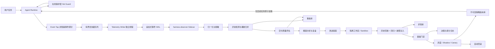

# Agent 自我监控、异常修复与受控演进方案

> 状态：待评审，不含实现代码  
> 适用项目：`deepseek-aidops-stable` 及其构建出的 Agent 运行时  
> 文档版本：V1.0  
> 日期：2026-09-11

## 1. 评审结论摘要

本方案建议采用 **“主 Agent 数据面 + 在线保护层 + 独立观察/演进控制面”** 的混合架构：

- 主 Agent 只负责执行任务，并以非阻塞方式产生结构化事件；
- 少量必须立即生效的确定性保护规则留在主运行时，例如重复空转熔断、工具故障隔离、检查点恢复；
- 独立 `harness-observer` sidecar 进程负责事件归并、异常识别、质量评估、根因分析、复盘和改进提案；
- 所有改进先成为带证据的候选版本，在隔离环境完成历史回放、回归测试、故障注入和灰度对比；
- 只有通过晋级门禁的版本才能在**后续任务**中原子启用；失败时自动回滚到上一稳定版本；
- 业务规则变化和高风险代码修改默认必须人工批准。Agent 可以自主发现、总结、提案和验证，但不能仅凭自己的文字判断直接改写生产运行机制。

该方案追求的不是“Agent 永不出错”，而是实现以下闭环：

```text
可观测 → 可归因 → 可复现 → 可修复 → 可验证 → 可灰度 → 可回滚 → 可沉淀
```

首期不应直接做“自动改代码”。推荐先完成事件事实链、确定性异常检测和离线回放；事实基础稳定后，再逐级开放低风险自适应能力。

## 2. 背景与问题定义

Agent 在真实工作中可能出现三类问题：

1. **软件异常**：进程崩溃、Provider 协议错误、工具超时、权限错误、持久化损坏、并发竞态、资源耗尽；
2. **Agent 行为异常**：重复陈述同一结论、重复调用同一工具、无新证据空转、阶段死锁、计划漂移、虚报完成、过早停止、预算异常消耗；
3. **业务与交付异常**：遗漏验收面、修改错误对象、违反业务约束、测试通过但用户目标未完成、交付不可复现、用户多次纠正或要求继续。

现有运行时已经有可复用基础：

- `SessionEvent` 保存回合、步骤、模型、工具、用量、遥测和交付事件；
- `ExecutionTelemetry` 提供阶段、工具数、证据数、工作项状态、无信息次数和纠正次数；
- `DeliveryReport` 是运行时交付真相源，区分 `Verified`、`NeedsUserInput`、`PartialDelivery`、`SystemFailure` 等状态；
- `TurnGovernor`、`CaseFile` 和目标执行框架已有进展/停滞判定能力；
- LHA 已有 `LeaseWatchdog`、`FactMatrix`、`QualityGate`、`EffectJournal`、`ArtifactVault`、`Blackboard` 和持久 DAG；
- 本地知识库已有 L0–L3 生命周期、候选审核、来源引用、冲突检测与晋升思路。

因此，本方案不再建立一套平行的 Agent 框架，而是在这些事实源上增加一套独立的 **Agent Reliability & Evolution Control Plane（可靠性与演进控制面）**。

## 3. 目标与非目标

### 3.1 目标

- 主任务执行与监控分析解耦，监控故障不拖慢或阻断正常工作；
- 软件、行为、业务、交付质量异常均能形成统一且可检索的事件与事故记录；
- 每个异常都能关联到任务、步骤、工作项、工具调用、运行版本和证据；
- 能在线止住明显空转，并在任务后自动生成可信复盘；
- 能从真实事故中生成改进候选，在隔离环境自动回放验证；
- 能对配置、提示、策略、技能和代码变更分级治理；
- 改进可版本化、可审计、可灰度、可撤销；
- 长期形成“失败案例库 + 回归语料库 + 已验证策略/技能库”。

### 3.2 非目标

- 不承诺完全依赖 LLM 自动判断业务正确性；没有业务契约或外部证据时，系统必须承认不可判定；
- 不允许运行中的 Agent 直接热改自身二进制；
- 不允许未验证的复盘结论直接进入默认记忆或技能库；
- 不以增加更多重试或更大 token 预算代替根因修复；
- 不用单一“总分”掩盖安全、正确性或验收覆盖等硬失败；
- 首期不建设复杂分布式平台，先落地本机可靠闭环。

## 4. 核心设计原则

1. **事实优先于自述**：工具结果、工作区差异、测试报告、哈希、交付门禁是事实；模型说“完成了”不是事实。
2. **旁路不阻塞**：耗时分析不进入 Agent 主调用链；监控服务失效时主任务仍可继续。
3. **在线保护确定化**：需要毫秒级响应的保护规则必须是有界、可预测、无 LLM 依赖的逻辑。
4. **检测与修复解耦**：检测到异常不等于自动修改；先冻结证据，再归因、提案、验证和晋级。
5. **角色分离**：执行者、观察者、验证者、晋级控制器不能共享“自报即通过”的权限。
6. **默认最小权限**：观察器默认只读；只有沙箱执行器可写隔离工作区；晋级器只能切换已批准版本。
7. **失败开放、质量关闭**：监控系统故障不阻断普通任务；但缺少交付证据时，质量门禁必须拒绝 `Verified`。
8. **不变量先于评分**：安全、验收覆盖、证据真实性等硬门禁通过后，才比较效率和体验分数。
9. **版本不可变**：每次策略、提示、技能、配置或代码变化都生成新版本，禁止原地静默覆盖。
10. **学习带有效期**：改进必须记录适用边界、来源、验证集、置信度和失效条件。

## 5. 总体架构



### 5.1 为什么采用“线程 + 独立进程”而不是二选一

仅用主进程线程，无法隔离死锁、内存泄漏、崩溃和高 CPU 分析；仅用外部进程，则难以及时阻止单轮内的重复空转。因此采用三层：

| 层 | 运行位置 | 职责 | 是否允许 LLM |
| --- | --- | --- | --- |
| Event Tap | 主进程调用点 | 构造小事件并 `try_send` | 否 |
| Hot Guard | 主运行时 | 即时判定重复、无进展、故障隔离和受控恢复 | 否 |
| Observer / Evolution Plane | 独立进程 | 聚合、评分、复盘、提案、回放、灰度决策 | 可选，且不能单独决定晋级 |

Telemetry Writer 使用独立线程批量写 WAL，使主循环不承担序列化大对象、磁盘同步和日志轮转成本。Observer 读取 WAL，即使重启也能从游标恢复。

## 6. 运行边界与组件职责

### 6.1 主 Agent Runtime

主进程保留业务执行权，只增加三个轻量接口：

- `emit(event)`：非阻塞投递事件；
- `guard(observation)`：返回有限集合的在线保护决策；
- `checkpoint()`：在安全点保存可恢复执行状态。

主进程不得同步等待以下动作：

- LLM 复盘；
- 跨会话统计；
- 历史回放；
- 生成或编译补丁；
- 大文件归档；
- 仪表盘聚合。

### 6.2 在线保护层 Hot Guard

Hot Guard 只执行预先定义的状态转移：

- 抑制完全相同的重复工具调用；
- 在连续无证据增量时切换假设或进入可行动终态；
- 模型连续输出近似相同结论时停止再请求模型，并由 Runtime 生成一次结构化交付；
- Provider 协议异常仅允许一次改变请求形态的恢复；
- 工具连续失败后打开工具级 circuit breaker；
- 子任务租约过期时回收并从检查点恢复；
- 预算接近上限时保留必要验证，不再开放新探索；
- 检测到交付陈述与 `DeliveryReport` 冲突时，以 Runtime 报告为准。

Hot Guard 不执行开放式反思，不修改业务目标，不扩大权限，也不自动把失败归因给用户。

### 6.3 `harness-observer` Sidecar

建议新增独立可执行进程，包含：

- `Collector`：按游标消费事件 WAL；
- `Normalizer`：统一版本、时间、错误码和工具身份；
- `Redactor`：持久化前删除密钥、令牌、隐私数据和超大原文；
- `DetectorEngine`：执行确定性规则和统计检测器；
- `IncidentCorrelator`：按指纹合并相同事故；
- `QualityEvaluator`：按任务类型执行硬门禁与评分；
- `RootCauseAnalyzer`：形成带证据、可证伪的根因候选；
- `ImprovementPlanner`：生成配置、策略、提示、技能或代码提案；
- `ReplayCoordinator`：调度隔离回放、对照实验和故障注入；
- `PromotionController`：执行晋级、灰度与回滚状态机；
- `ReportPublisher`：生成面向用户和开发者的精简报告。

### 6.4 Supervisor

Desktop/CLI 启动时由 Supervisor 管理 sidecar：

- sidecar 崩溃采用有上限的指数退避重启；
- 重启次数超过阈值后进入 `ObserverDegraded`，主 Agent 继续工作；
- Observer 版本必须与事件 schema 兼容；不兼容时只归档事件，不做错误解释；
- 主进程退出时允许 writer 在短超时内冲刷关键事件，超时则写入丢失计数并退出。

## 7. 统一事件模型

### 7.1 事件信封

以下为数据契约示意，不是本轮代码：

```rust
struct AgentEventEnvelope {
    schema_version: u16,
    event_id: String,
    occurred_at_ms: u64,
    trace_id: String,
    session_id: String,
    turn_id: String,
    step_id: Option<String>,
    task_id: Option<String>,
    work_item_id: Option<String>,
    producer: String,
    runtime_version: String,
    policy_bundle: String,
    event_type: String,
    severity: Severity,
    payload: Value,
    evidence_refs: Vec<EvidenceRef>,
    privacy: PrivacyClass,
    previous_hash: Option<String>,
}
```

必须满足：

- 全局事件 ID 幂等；
- 每个事件能追踪到运行版本、策略版本和任务上下文；
- 大工具结果只保存摘要、内容哈希和 Artifact Vault 引用；
- 顺序依赖由 `trace_id + event sequence` 表达；
- 高价值事件带前序哈希，便于发现截断或篡改；
- 时间戳不作为唯一顺序依据。

### 7.2 事件类别

| 类别 | 代表事件 |
| --- | --- |
| 生命周期 | `ProcessStarted`、`TurnStarted`、`StepStarted`、`TurnFinished`、`ProcessCrashed` |
| 模型 | `ModelRequested`、`ModelCompleted`、`OutputTruncated`、`ProtocolEmpty`、`ProviderFailed` |
| 工具 | `ToolProposed`、`ToolStarted`、`ToolSucceeded`、`ToolFailed`、`ToolTimedOut`、`ToolRejected` |
| 进展 | `EvidenceAdded`、`HypothesisEliminated`、`WorkItemChanged`、`CheckpointSaved` |
| 行为异常 | `DuplicateAction`、`RepeatedConclusion`、`NoProgressLoop`、`PlanDrift`、`BudgetRunaway` |
| 交付 | `CriterionEvaluated`、`VerificationRecorded`、`DeliveryJudged`、`DeliveryContradiction` |
| 用户反馈 | `UserCorrected`、`UserRejected`、`UserContinued`、`UserRevertedChange` |
| 自愈 | `MitigationApplied`、`ToolQuarantined`、`ResumeSucceeded`、`ResumeFailed` |
| 演进 | `ProposalCreated`、`EvaluationCompleted`、`PromotionApproved`、`CanaryRolledBack` |
| 监控自身 | `ObserverLagging`、`EventDropped`、`SchemaRejected`、`StorageDegraded` |

### 7.3 优先级与丢弃策略

事件分两条有界队列：

- **Critical**：崩溃、写入、外部副作用、交付、用户拒绝、版本切换；禁止采样，优先冲刷；
- **Normal**：思考摘要、只读调用、阶段遥测；拥塞时允许采样或合并。

主线程使用 `try_send`，不等待消费者。Normal 队列满时累计 `dropped_normal_count`；下一次成功写入时补发聚合事件。Critical 队列持续满时写最小 emergency record，但不得在主循环无限等待。

## 8. 异常分类、严重度与在线响应

### 8.1 严重度

| 等级 | 定义 | 默认响应 |
| --- | --- | --- |
| S0 | 安全、数据破坏、越权或不可逆外部影响 | 立即停止相关动作，隔离版本，必须人工复核 |
| S1 | 虚报 Verified、错误交付、持续崩溃、业务严重偏离 | 终止当前路径，保存证据，自动回滚候选版本 |
| S2 | 可恢复的软件故障、重复空转、明显效率退化 | 在线止血，任务后自动复盘 |
| S3 | 单次抖动、低影响告警、观测缺口 | 记录并进入趋势分析 |

### 8.2 软件异常

| 异常 | 识别依据 | 在线动作 | 后台动作 |
| --- | --- | --- | --- |
| 进程 panic/crash | crash envelope、非正常退出码 | Supervisor 重启并恢复最近安全检查点 | 生成 crash incident、符号化堆栈、关联版本 |
| Provider 协议异常 | 空响应、非法 tool call、反序列化失败 | 仅一次“改变请求形态”的恢复 | 聚合 Provider/模型/请求大小趋势 |
| 工具超时或失败风暴 | 滑动窗口失败率和连续失败数 | 打开工具 circuit breaker，选择已批准降级路径 | 生成最小复现与工具健康报告 |
| 存储损坏 | WAL 尾部、hash、sequence 校验失败 | 隔离损坏尾部，保留可读前缀 | 修复副本并报告数据缺口 |
| 资源耗尽 | RSS、CPU、句柄、磁盘、token 接近阈值 | 降低并发/停止新探索/仅保留验证 | 分析泄漏、超大事件和预算来源 |
| 并发竞态 | 租约冲突、MVCC 冲突、重复副作用键 | 拒绝第二写者或幂等返回 | 关联 EffectJournal 与 ArtifactVault 记录 |

### 8.3 Agent 行为异常

| 异常 | 确定性信号 | 建议阈值（初始值） |
| --- | --- | --- |
| 重复结论 | 对规范化 assistant 输出做相似度/指纹，且期间无证据增量 | 连续 2 次高度相似告警，3 次强制收敛 |
| 重复工具调用 | 工具名 + 规范化参数 + 作用域相同，前次已成功且状态未变 | 第 2 次拒绝；验证命令仅在写入后允许重跑 |
| 无进展空转 | 工具/模型步骤未新增证据、未排除假设、未改变工作项 | 连续 2 步切换假设；无可用假设则终止 |
| 阶段死锁 | 当前阶段无允许工具，模型仍反复请求被拒工具 | 首次由 Runtime 转移；再次进入 `SystemFailure` |
| 计划漂移 | 动作无法关联活动验收项或风险边界 | 拒绝动作并记录，不通过重复提示纠错 |
| 虚报完成 | 模型完成陈述与 `DeliveryReport`/证据冲突 | 覆盖模型结论，记为 S1 |
| 预算失控 | 成本增加但验收/证据斜率为零 | 停止新探索，保留一次必要验证 |
| 恢复失效 | 同类恢复输入、上下文和参数均未变化 | 禁止第二次原样恢复 |

阈值必须可配置并通过回放校准；上表是首个可运行默认值，不是不可变业务规则。

### 8.4 业务异常

业务异常必须建立在 `GoalContract + AcceptanceCriteria + Workspace Evidence` 上，不能只由通用模型主观判断：

- 验收项遗漏或表面覆盖不完整；
- 修改对象、项目、分支或环境不匹配；
- 违反明确的业务不变量；
- 数据流、权限、状态迁移或兼容性约束被破坏；
- 用户撤回、否定或重复纠正已交付结果；
- 测试通过但验收标准没有对应证据；
- 只修复症状，没有覆盖可复现的根因链。

没有可执行验收标准的业务判断应标记为 `NeedsBusinessOracle`，不得自动修改业务策略。

## 9. 事故模型与归并

### 9.1 Incident 结构

```rust
struct Incident {
    incident_id: String,
    fingerprint: String,
    category: IncidentCategory,
    severity: Severity,
    state: IncidentState,
    first_seen_ms: u64,
    last_seen_ms: u64,
    occurrence_count: u64,
    affected_versions: Vec<String>,
    affected_tasks: Vec<String>,
    evidence_refs: Vec<EvidenceRef>,
    suspected_components: Vec<String>,
    root_cause_hypotheses: Vec<Hypothesis>,
    reproducer: Option<ReplaySpec>,
    mitigations: Vec<MitigationRecord>,
    proposal_ids: Vec<String>,
}
```

状态机：

```text
New → Grouped → Triaged → Reproduced → RootCauseSupported
    → ProposalReady → Evaluating → Approved → Canary
    → Resolved / RolledBack / Rejected / Quarantined
```

无法复现不等于已解决；它进入 `NeedsMoreEvidence` 并保留观察窗口。

### 9.2 指纹策略

指纹不是简单错误文本哈希，而是以下稳定字段的组合：

- 异常类别与规范化错误码；
- 运行组件、阶段、工具或 Provider；
- 调用形状和作用域，不包含密钥或随机 ID；
- 工作项状态转移；
- 证据增量模式；
- 运行版本和策略版本作为维度，不直接打散同类事故。

这样既能把“同一个问题换了措辞”的事件合并，也能比较某次版本升级前后的发生率。

## 10. 交付质量评估体系

### 10.1 先硬门禁，后评分

任何一个硬门禁失败，最终状态都不能是 `Verified`：

1. 所有必要验收项均有证据；
2. 证据引用存在、哈希有效且来源允许独立验证；
3. 修改类任务至少有工作区 diff 或等价副作用记录；只读任务则必须有可复核的诊断证据；
4. 必要构建、测试、静态检查或业务验证已执行且结果明确；
5. 没有未处置的 S0/S1 异常；
6. 模型陈述与 `DeliveryReport`、`FactMatrix` 不冲突；
7. 外部副作用经过 `EffectJournal` 幂等和权限检查；
8. 用户要求的范围、禁止项和交付格式均已覆盖。

### 10.2 质量维度

硬门禁通过后，再计算用于版本对比的 0–100 分：

| 维度 | 建议权重 | 说明 |
| --- | ---: | --- |
| 正确性 | 35 | 验证结果、事实一致性、回归是否通过 |
| 完整性 | 25 | 验收项、交付面、异常路径覆盖 |
| 证据质量 | 15 | 可复现、可定位、来源独立、无自证循环 |
| 健壮性 | 10 | 故障恢复、幂等、回滚、边界条件 |
| 效率 | 10 | 有效调用率、重复率、token/时间成本 |
| 交互质量 | 5 | 用户纠正次数、无效澄清、无结论式重复 |

权重按任务类型配置。诊断任务不要求代码 diff，编码任务不能只用语言质量得高分。

### 10.3 核心指标

- `acceptance_coverage = 有有效证据的已满足验收项 / 必要验收项`
- `evidence_validity = 独立验证通过的证据 / 被引用证据`
- `first_pass_verified_rate = 无需用户发送“继续/重做”即 Verified 的任务 / 可完成任务`
- `false_verified_rate = 后续被测试、用户或事实推翻的 Verified / Verified`
- `no_progress_step_rate = 无证据增量步骤 / 总步骤`
- `duplicate_action_rate = 被判定重复的模型或工具动作 / 总动作`
- `tool_success_to_progress_rate = 产生信息增益的成功工具调用 / 成功工具调用`
- `recovery_success_rate = 恢复后达到可行动终态 / 恢复尝试`
- `mean_time_to_containment`：从异常出现到停止扩大影响的时间；
- `mean_time_to_verified_repair`：从事故建立到候选通过验证的时间；
- `rollback_rate`、`canary_regression_rate`、`user_correction_rate`；
- `cost_per_verified_criterion`：每个已验证验收项的 token、工具和时间成本。

禁止单独优化“工具次数少”或“响应短”。效率提升必须同时满足正确性和完整性不下降。

### 10.4 评估者独立性

质量结论按可信度分层：

1. **P0 硬事实**：测试、构建、diff、哈希、状态机不变量；
2. **P1 规则判断**：覆盖率、重复率、预算、错误分类；
3. **P2 模型评审**：语义完整性、根因候选、用户体验；
4. **P3 用户/业务反馈**：业务口径确认、拒绝、撤回、生产效果。

P2 模型评审只能补充解释，不能推翻 P0/P1。必要时可使用与执行者隔离的 evaluator 配置，但“换一个模型打分”仍不等于独立证据。

## 11. 在线自愈机制

### 11.1 可自动执行的预授权动作

以下动作可在预设边界内自动执行并完整记录：

- 一次协议级重试，且请求必须发生可验证变化；
- 从最近安全检查点恢复；
- 降低并发、缩小上下文、关闭非必要工具；
- 对连续故障工具或 Provider 打开临时 circuit breaker；
- 切换到配置中预先批准的备用 Provider/工具；
- 重领已过期但无不可逆副作用的任务租约；
- 抑制重复输出并由 Runtime 直接形成一次结构化结论；
- 达到无进展阈值时切换有限假设，或进入明确终态；
- sidecar 故障时降级为“只记录，不分析”。

### 11.2 不可自动执行的动作

- 扩大文件、网络、系统或账号权限；
- 修改用户业务目标或验收口径；
- 绕过安全/质量门禁；
- 对不可逆外部副作用进行猜测性重试；
- 把未经验证的经验写入活动技能或长期事实；
- 在原工作区覆盖用户未提交改动；
- 直接替换正在运行的二进制；
- 对高风险候选执行无人值守全量晋级。

## 12. 自我总结与演进闭环

### 12.1 每次任务后的自动总结

Observer 在 `TurnFinished` 后产生 `TaskRetrospective`：

- 目标和验收项；
- 实际状态迁移；
- 有效证据与无效尝试；
- 异常、止血动作和恢复结果；
- 最终交付状态及其可信度；
- 用户纠正或拒绝；
- 可复用经验候选；
- 明确的不适用边界与失效条件。

总结先进入候选区，不直接污染活动上下文。只有 `Verified` 且证据链完整的事实，才可进入 `.harness-memory/review/`；失败会话主要进入事故库和回归语料库。

### 12.2 改进提案类型

| 类型 | 示例 | 风险级别 | 默认晋级方式 |
| --- | --- | --- | --- |
| 阈值/配置 | 重复阈值、队列容量、超时、并发 | 低到中 | 回放 + shadow，可自动灰度 |
| 路由/策略 | 工具白名单、恢复分支、阶段转移 | 中 | 回放 + canary，有限自动晋级 |
| 提示模板 | 结构化输出、当前阶段约束 | 中 | 对照评测 + canary |
| 技能 | 新增可复用修复流程和验证规则 | 中 | 候选审核 + 多次成功验证 |
| 代码补丁 | Runtime、Provider、工具、UI 代码 | 高 | 隔离构建和全量回归，默认人工批准 |
| 业务规则 | 验收口径、权限、领域行为 | 高/语义风险 | 必须业务负责人批准 |

### 12.3 ImprovementProposal 契约

每个提案必须包含：

- 关联事故和证据；
- 可证伪的根因假设；
- 改动类型、作用范围和版本基线；
- 预计改善的指标与不可下降指标；
- 风险等级、权限需求和回滚方法；
- 最小复现、历史回放集、黄金用例和反例；
- 有效期和适用边界；
- 提案生成器版本；
- 是否要求人工批准及批准角色。

缺少复现或度量预期的提案只能标记为 `Exploratory`，不能晋级。

## 13. 隔离验证与晋级

### 13.1 验证流水线

```text
事故证据冻结
  → 最小复现稳定通过（证明旧版会失败）
  → 生成候选版本
  → 候选修复最小复现
  → 相关单测/集成测试
  → 历史事故回放
  → 黄金成功任务回放
  → 对抗与故障注入
  → 全工作区回归
  → 基线对比
  → Shadow
  → Canary
  → 晋级或回滚
```

最小复现必须先证明能够区分“旧版失败”和“候选成功”，防止产生只会让新增测试通过的伪修复。

### 13.2 回放语料组成

- 已确认的软件事故；
- 用户拒绝、纠正、撤回和重复“继续”的真实任务；
- 已成功的一次性交付任务，防止修复引入保守退化；
- 重复结论、重复工具、无进展、错误工作区、权限缺失等控制流用例；
- Provider 空响应、截断、429、超时、非法工具参数；
- 工具慢响应、部分写入、存储尾部损坏、进程中断；
- 并发租约、MVCC 冲突、幂等副作用；
- 无需修改、只读诊断、部分交付、必须询问用户等合法终态。

回放输入、模拟工具和期望状态必须版本化。生产原始数据先脱敏，无法安全脱敏的只保留合成最小复现。

### 13.3 晋级硬门禁

候选版本只有同时满足以下条件才能进入 Canary：

- 目标事故复现集通过率达到 100%；
- 所有 S0/S1、安全和副作用用例通过；
- `false_verified_rate` 不上升；
- 黄金用例的正确性和验收覆盖不下降；
- 重复率、无进展率或目标指标达到提案声明的最小改善；
- 全工作区必需测试通过；
- 可成功执行回滚演练；
- 数据 schema 向后兼容，或包含经过验证的迁移和降级路径；
- 高风险类别具备有效人工批准记录。

样本量不足时只能延长 Shadow，不能用单次成功自动晋级。

### 13.4 Shadow 与 Canary

- **Shadow**：候选只读取同一事件并产生决策，不影响主任务；比较其建议与当前稳定版结果。
- **Canary**：仅对低风险、可回滚、用户允许的少量新任务生效；不迁移运行中任务。
- **Stable**：达到最小样本量和观察窗口后才成为默认版本。
- **Quarantined**：触发回滚的候选不可自动重新启用，必须产生新版本。

### 13.5 自动回滚条件

任一条件触发即撤回 Canary：

- 新增 S0/S1 事故；
- `false_verified_rate` 或用户撤回率超过基线保护阈值；
- crash、超时、无进展率显著恶化；
- 事件丢失、schema 错误导致评估不可置信；
- 关键黄金用例失败；
- 版本健康心跳缺失。

回滚只切换活动 manifest，保留事故、候选和评测证据，不删除失败历史。

## 14. 自主演进成熟度

建议按能力逐级开放，不能跨级：

| 级别 | 能力 | 自动权限 |
| --- | --- | --- |
| E0 Observe | 记录、仪表盘、人工分析 | 无修改权 |
| E1 Summarize | 自动事故归并和任务复盘 | 只能写候选区 |
| E2 Propose | 生成配置/策略/提示/技能/代码提案 | 只能写隔离区 |
| E3 Validate | 自动回放、测试、对照和风险报告 | 只能操作沙箱 |
| E4 Low-risk Promote | 低风险配置/阈值/已审核技能灰度 | 受策略限定，可自动回滚 |
| E5 Restricted Evolution | 特定中风险策略自动晋级 | 需显式开启、充分样本和审计 |

代码补丁和业务规则默认始终停留在 E3，评审通过后由人批准晋级。未来若要开放代码自动晋级，应另行形成威胁模型和权限评审，不属于本方案默认范围。

## 15. 版本包与激活模型

活动机制不是一组散落且被原地编辑的文件，而是不可变 `PolicyBundle`：

```text
bundle-id/
├── manifest.json          # 版本、schema、父版本、兼容范围、签名/哈希
├── runtime-policy.toml    # 阶段、预算、恢复、门禁、阈值
├── prompts/               # 受版本控制的提示模板
├── skills/                # 只包含已晋升技能
├── detector-rules/        # 确定性检测规则
├── migrations/            # 可选 schema 迁移说明
└── evaluation.json        # 回放集版本、指标、基线和批准记录
```

激活流程：

1. 将完整 bundle 写入新目录；
2. 校验 schema、内容哈希、依赖和兼容性；
3. 原子更新 `active-manifest` 指针；
4. 仅新任务读取新版本；运行中任务固定其启动版本；
5. 保留最近稳定版本和回滚点；
6. 回滚时原子切回旧 manifest。

## 16. 存储布局

建议使用工作区本地、可审计但不默认提交的目录：

```text
.harness/self-monitor/
├── spool/
│   ├── events-YYYYMMDD-N.jsonl
│   └── cursors/
├── incidents/
│   └── YYYY/MM/<incident-id>.json
├── retrospectives/
├── evaluations/
│   ├── corpora/
│   └── runs/
├── proposals/
│   ├── pending/
│   ├── approved/
│   ├── rejected/
│   └── quarantined/
├── bundles/
│   ├── stable/
│   └── candidates/
├── state/
│   ├── active-manifest.json
│   ├── observer-checkpoint.json
│   └── health.json
└── reports/
```

大型证据和版本产物复用 LHA `ArtifactVault`；外部副作用复用 `EffectJournal`；任务/Worker 状态复用持久 DAG 和 `LeaseWatchdog`；已验证的可复用经验才投影到 `.harness-memory/review/`。

索引和派生报告可重建；事件 WAL、事故记录、晋级决策和版本 manifest 是权威审计数据。

## 17. 与现有模块的具体集成

| 现有模块 | 复用方式 | 需要补足的边界 |
| --- | --- | --- |
| `harness-session::SessionLog` | 主事实流来源 | 增加稳定 trace/turn/step 关联和 schema 版本 |
| `SessionEvent::Telemetry` | 阶段、工具、证据、纠正观测 | 扩展异常/恢复/版本事件，不把大正文复制进事件 |
| `DeliveryReport` | 交付状态唯一真相源 | 增加评估引用、版本和反证关联 |
| `CaseFile` / `TurnGovernor` | 在线进展与终止事实 | 将决策原因结构化输出给 Observer |
| Goal Execution / WorkItem | 业务验收和进展单位 | 每个动作必须关联 criterion/work item/hypothesis |
| `LeaseWatchdog` | 回收僵尸 Worker | 不承担语义异常检测，事件接入统一事故流 |
| `FactMatrix` / `QualityGate` | 编译、测试、不变量硬门禁 | 扩展任务类型化 gate profile |
| `ArtifactVault` | 保存不可变证据和候选产物 | 统一 evidence URI 与保留策略 |
| `EffectJournal` | 外部副作用、幂等、补偿、HITL | 自愈动作也必须按 effect class 记录 |
| `Blackboard` | Worker 间轻量事件引用 | 不替代全量观测 WAL，避免上下文广播 |
| `ConversationMemory` | 保存成熟事实 | 只接收通过晋升的事实，不接收原始异常噪声 |
| 本地知识库 review/promote | 经验候选与审核 | 增加事故/评测来源和失效条件 |
| GUI | 健康、事故、质量和版本视图 | 不把详细遥测重新注入模型上下文 |

## 18. 资源、性能与可靠性目标

以下是建议验收目标，实施后以基准测试校准：

- Event Tap 的 P99 主线程耗时低于 1 ms；
- 监控开启后，正常任务端到端性能开销目标低于 2%；
- Normal 事件允许受控丢弃，但 Critical 事件持久化成功率目标不低于 99.99%；
- sidecar 停止 24 小时后仍可从 WAL 游标继续消费；
- sidecar 的 CPU、内存、磁盘、并发和 LLM token 有独立硬预算；
- 事件积压超过阈值时先停止深度评审和 LLM 复盘，不向主 Agent 施加反压；
- WAL 按大小和日期轮转，达到保留期限后先聚合再清理；
- 任何版本激活和回滚必须是原子操作；
- 监控系统本身也产生健康事件，避免“监控坏了却显示一切正常”。

## 19. 安全与隐私

- 工具输入输出在进入持久化前执行字段级和模式级脱敏；
- 密钥、访问令牌、Cookie、密码、私钥和环境敏感值不得进入事故包或回放语料；
- 原始用户内容默认仅保存在现有 SessionLog 权限边界，Observer 优先消费摘要和引用；
- 回放默认禁网、限制文件写入范围，并使用合成或脱敏数据；
- 自愈动作沿用 SandboxTx、EffectJournal、幂等键和 HITL；
- Observer 只读生产工作区，补丁生成在独立 worktree/临时工作区；
- 版本包以哈希校验，批准记录包含提案、评测、审批人和时间；
- 删除与保留策略按项目配置，事故审计数据和用户内容分开管理；
- 用户可关闭语义复盘，仅保留确定性监控。

## 20. 配置建议

沿用现有 `.harness.toml`，建议新增以下逻辑配置段；具体字段在实现阶段冻结：

```toml
[self_monitor]
enabled = true
mode = "observe"                  # off | observe | protect | evolve
sidecar = true
redaction = "strict"
retention_days = 30

[self_monitor.hot_guard]
repeat_warning = 2
repeat_stop = 3
no_progress_switch = 2
protocol_recovery_limit = 1

[self_monitor.evolution]
max_level = "E3"
shadow_enabled = true
canary_percent = 0
auto_promote_low_risk = false
require_human_for_code = true
require_human_for_business_rules = true
```

推荐首发默认值为 `mode = "protect"`、`max_level = "E2"`；回放体系稳定后升到 E3。E4 必须由用户显式开启。

## 21. 典型场景：反复陈述同一结论但没有交付

以“连续多轮重复说明没有编辑工具、重复给出同一个 cargo 命令、没有新增证据和交付状态”为例：

1. `RepeatedConclusionDetector` 对输出去除序号、空白和轮次措辞后生成语义指纹；
2. 第 2 次重复且 `evidence_delta = 0` 时产生 S2 告警；
3. Hot Guard 不再把同一提醒送入下一模型回合，而是检查真实能力清单和执行上下文；
4. 若能力确实缺失，Runtime 直接生成一次 `SystemFailure` 或 `NeedsUserInput`，明确缺失能力、已完成事实和唯一可行动请求；
5. 若能力实际存在但未注入，则记为 `CapabilityInjectionMismatch`，停止继续提示模型；
6. 第 3 次重复前必须收敛，禁止以换句式继续消耗回合；
7. Observer 将该会话冻结成最小回放，候选修复需证明：旧版稳定复现、候选版一次终止、其他正常任务不被误杀；
8. 只有回放和黄金任务同时通过，重复检测阈值或能力注入修复才可进入灰度。

这个机制不会把“重复三次就强制成功”当作修复；它只会阻止空转，并给出与事实相符的可行动终态。

## 22. 分阶段落地计划

### Phase 0：契约与基线

交付：

- 冻结事件、事故、评估、提案和版本包 schema；
- 为现有 `SessionEvent`、`ExecutionTelemetry`、`DeliveryReport` 建映射；
- 建立一组真实问题基线，包括重复结论案例；
- 明确保留、脱敏和权限策略。

验收：

- 任一任务可以从 Session 到 Delivery 完整关联；
- 关键事件可验证顺序和内容哈希；
- schema 可向前忽略未知字段、向后读取当前稳定版本。

### Phase 1：非阻塞采集与在线保护

交付：

- Event Tap、有界双队列、writer thread、WAL 和 sidecar supervisor；
- 重复、无进展、工具失败风暴、交付冲突等确定性 detector；
- Hot Guard 和结构化止血事件。

验收：

- sidecar 退出、卡死或积压不阻断 Agent；
- 重复结论案例最多在阈值内收敛；
- Critical 事件在故障重启后可恢复；
- 性能开销达到第 18 节目标。

### Phase 2：事故库与质量体系

交付：

- Incident Correlator、严重度、状态机和根因候选；
- 类型化质量门禁、质量报告和基础仪表盘；
- 用户纠正/撤回/继续信号闭环。

验收：

- 同类事故跨会话正确归并，版本维度可比较；
- 虚报完成必定被门禁拦截；
- 质量报告中的每个结论可追溯到事实或明确标注为模型判断。

### Phase 3：回放与自动提案

交付：

- 脱敏事件到 ReplaySpec 的转换；
- deterministic fake LLM / fake tool 回放；
- 黄金集、事故集、对抗集和故障注入；
- 自动复盘和 ImprovementProposal。

验收：

- 目标事故能稳定区分旧版与候选版；
- 评测可复跑并得到同一确定性结果；
- 未验证提案不能进入活动配置或知识库。

### Phase 4：低风险灰度演进

交付：

- 不可变 PolicyBundle、Shadow、Canary、原子激活和自动回滚；
- 仅开放预批准的低风险配置/阈值/技能变化；
- GUI 审批、版本对比和回滚入口。

验收：

- 候选失败自动回滚且不影响运行中任务；
- 可追溯“为何改、谁批准、测了什么、改善多少”；
- 无法绕过 `max_level` 和风险分类。

### Phase 5：隔离代码自修复

交付：

- 在独立 worktree 生成代码补丁；
- 构建、测试、回放、故障注入和评审报告；
- 人工批准后发布新二进制版本。

验收：

- 不接触用户现有未提交变更；
- 旧版失败、候选成功、黄金集不退化；
- 发布和回滚均经过完整演练；
- 默认仍不允许无人值守代码晋级。

## 23. 计划中的代码落点（评审通过后实施）

本节只定义建议边界，不代表已经创建：

```text
harness/
├── harness-session/src/observability.rs       # 公共事件契约
├── harness-runtime/src/monitoring/
│   ├── mod.rs
│   ├── event_tap.rs                           # 非阻塞采集
│   ├── hot_guard.rs                           # 在线确定性保护
│   ├── checkpoint.rs
│   └── monitor_adapter.rs                     # 现有事件映射
├── harness-observer/                          # 新 workspace crate / sidecar
│   └── src/
│       ├── collector.rs
│       ├── detector.rs
│       ├── incident.rs
│       ├── quality.rs
│       ├── retrospective.rs
│       ├── proposal.rs
│       ├── replay.rs
│       └── promotion.rs
└── harness-ui/src/gui/self_monitor_panel.rs
```

优先复用 LHA 和本地知识库能力，不把 `ArtifactVault`、`EffectJournal`、Fact/Skill 晋升再实现一遍。

## 24. 必须具备的测试矩阵

| 测试层 | 最低覆盖 |
| --- | --- |
| 单元测试 | 指纹、归并、状态机、阈值、评分、脱敏、schema 兼容 |
| 属性测试 | 事件乱序/重复/缺失、幂等消费、任意重启不产生重复晋级 |
| 集成测试 | 主进程 + writer + sidecar、积压恢复、版本激活、自动回滚 |
| 故障注入 | sidecar 崩溃、WAL 半写、磁盘满、队列满、Provider 超时、工具卡死 |
| 安全测试 | 敏感信息不落盘、越权提案拒绝、签名/hash 篡改拒绝 |
| 回放测试 | 真实事故、黄金成功、只读任务、部分交付、需要用户输入 |
| 性能测试 | Event Tap P50/P95/P99、吞吐、积压、磁盘增长、主任务开销 |
| 演进测试 | 旧版复现、候选修复、无回归、Shadow、Canary、回滚 |

## 25. 主要风险与缓解

| 风险 | 后果 | 缓解 |
| --- | --- | --- |
| 监控反噬主流程 | 延迟、死锁、资源争抢 | 非阻塞队列、独立 writer/sidecar、独立预算、失败开放 |
| Agent 自证成功 | 错误策略被晋级 | 硬事实优先、独立验证、模型评审无最终权限 |
| 指标投机 | 为减少调用而漏做任务 | 正确性/完整性硬门禁，效率只作次级比较 |
| 错误经验污染记忆 | 后续任务持续偏离 | 候选隔离、来源校验、冲突检测、有效期和回滚 |
| 自动修复扩大影响 | 新回归或数据损坏 | 风险分级、沙箱、Shadow/Canary、代码和业务规则 HITL |
| 事件泄露敏感信息 | 隐私和安全事故 | 写入前脱敏、引用替代原文、权限与保留策略 |
| 回放不真实 | 测试通过但线上无效 | 真实脱敏事故 + 黄金集 + 故障注入 + Canary |
| 阈值误杀 | 正常深度任务被提前终止 | 以证据增量而非轮次数判断，按任务类型校准 |
| 观察器自身故障无人知晓 | 假健康 | 独立健康事件、积压/游标监控、Supervisor 降级状态 |
| 版本漂移 | 无法复现和回滚 | 每个事件绑定 runtime/policy/schema/corpus 版本 |

## 26. 评审决策点与推荐默认值

| ID | 决策 | 推荐值 |
| --- | --- | --- |
| D1 | 重分析部署形态 | 独立 `harness-observer` 进程；主进程仅 Event Tap + Hot Guard |
| D2 | 首发自主演进级别 | E2：可总结和提案，不自动晋级 |
| D3 | 在线保护模式 | 默认开启确定性重复/无进展/虚报完成保护 |
| D4 | 低风险自动灰度 | 首发关闭；Phase 4 经评测后显式开启 |
| D5 | 代码补丁晋级 | 永久默认人工批准 |
| D6 | 业务规则变更 | 必须业务负责人批准 |
| D7 | 本地事件保留 | 默认 30 天，关键事故与评测摘要长期保留，原文按隐私策略清理 |
| D8 | LLM 复盘 | 可关闭；关闭后确定性监控和回放仍完整可用 |
| D9 | 活动版本切换 | 只影响新任务，运行中任务固定启动版本 |
| D10 | 首个重点案例 | 重复结论/无进展、虚报完成、Provider 恢复、工具失败风暴 |

## 27. 方案实施总验收标准

方案最终落地必须同时满足：

1. Observer 被强制结束后，主 Agent 仍能完成正常任务；
2. 重复同一结论且无证据增量的案例能在阈值内一次性收敛；
3. 每个 `Verified` 都能追踪到验收项和独立证据；
4. 每个事故能追踪到 runtime、policy、任务、步骤和证据版本；
5. 自动总结不会把失败推测直接注入长期记忆；
6. 候选改进只有在旧版可复现、候选修复、黄金集无回归后才能灰度；
7. 任何活动版本均可原子回滚到上一稳定版；
8. sidecar、WAL、评测器自身异常可观测且不会静默丢失关键事实；
9. 代码和业务规则的修改无法绕过人工批准默认策略；
10. 全链路能够回答四个问题：**发生了什么、为什么、依据是什么、如何安全撤回**。

## 28. 推荐评审与实施顺序

本次评审建议只先确认 D1–D10、事件/事故契约、自动权限边界和分期范围。评审通过后，实施顺序固定为：

1. Phase 0 契约与基线；
2. Phase 1 非阻塞采集和确定性 Hot Guard；
3. Phase 2 事故与质量体系；
4. Phase 3 回放和提案；
5. 数据证明可靠后，再决定是否进入 Phase 4；
6. Phase 5 单独立项和安全评审。

这样可以先解决“重复、空转、无结论、虚报完成”这些当前最直接的问题，同时为真正的自我总结和迭代建立可信基础；不会一开始就把系统变成一个能够修改自己、却无法证明修改正确的黑盒。
