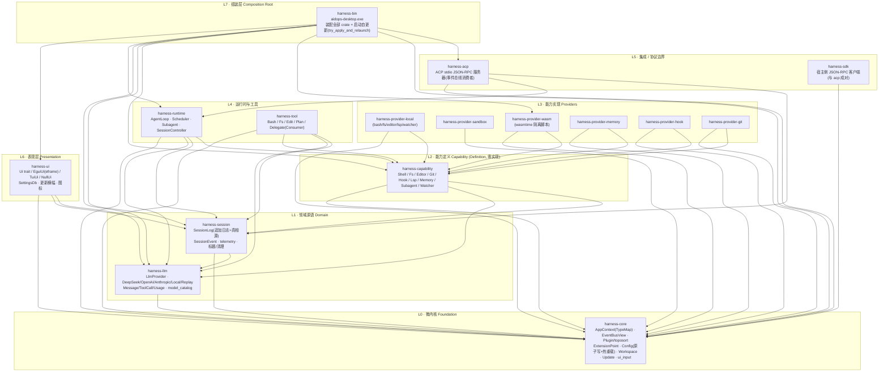

# deepseek-aidops-stable · 架构设计

> 本文聚焦**架构图**与**层次图**，把 `harness/` 下 17 个 crate 的分层、依赖方向与运行时数据流讲清楚。
> 详细设计哲学见 `docs/system-design-completion.md`；cc-switch 能力移植见 `docs/integrate-cc-switch-analysis.md`。

当前版本 `0.1.0`，产物为 `aidops-desktop.exe`（GUI 桌面端），同时可编译 TUI / headless 形态。

---

## 1. 设计哲学（一句话）

**微内核 + “一切皆插件”**：`harness-core` 只提供内核原语（服务仓库、事件总线、插件组合、配置、扩展点），所有业务能力都以 **Definition / Provider / Consumer** 三角色挂在它的能力接缝上。

### 三条关键不变量

1. **会话日志是真相源（Source of Truth）**：模型可见的一切都必须能从 `SessionLog`（追加事件流）重建；fork / resume / replay / telemetry 全部从这条流派生，运行时不在别处另存状态。
2. **Consumer 永不直接依赖 Provider**：工具（`harness-tool`）只依赖 `harness-capability` 的纯 trait（`Arc<dyn Shell>` 等）；把 `LocalBash` 换成 `WasmShell`，工具源码零改动。
3. **UI 是事件总线的纯消费者**：UI 在独立 tokio 任务里只订阅 `SessionLog` / 事件总线做渲染，**不反向调用核心循环**。

---

## 2. 层次图（Layered Architecture）

箭头 `A --> B` 表示 **“A 依赖 B”**（上层依赖下层）。`harness-core`（L0）不依赖任何内部 crate，是全场地基。



**读图要点**
- `session` 依赖 `llm`（复用 `Usage` 类型），所以 L1 内 `llm` 在 `session` 之下。
- `capability` 依赖 `llm` + `session`，是 L1 之上、L3 Provider 之下的“接口层”。
- `tool` / `runtime` 都在 L4，但 `runtime` 是编排者，`tool` 是被它调用的 Consumer。
- `ui` / `acp` / `sdk` 互不依赖，只通过 `core` 与下层对话，保证边界清晰。
- `bin` 是唯一把所有人拼起来的“组装根”，不含业务。

---

## 3. 运行时架构图（Request / Data Flow）

一次用户输入从进到出的完整链路，以及它与外部边界的关系：

```mermaid
flowchart LR
    U["用户"] -->|键入 / 点击发送| UI["harness-ui<br/>(事件总线消费者)"]

    UI -->|UiInputSink / LlmControl，configure_provider / reload_config| RT["harness-runtime<br/>AgentLoop"]

    RT -->|stream Chunk（含 usage 帧）| LLM["harness-llm<br/>DeepSeek / OpenAI / Anthropic / Local"]
    RT -->|调用 Arc(dyn Shell/Fs/Editor)| TOOL["harness-tool<br/>(Consumer, 只认 trait)"]
    TOOL -->|经导入表落地| PROV["harness-provider-*<br/>(Provider 实现)"]

    RT -->|追加 SessionEvent| LOG["harness-session<br/>SessionLog(追加日志=真相源)"]

    LOG -->|订阅 / 重放| UI
    RT -.->|外部请求→内部事件| ACP["harness-acp<br/>stdio JSON-RPC"]

    LLM -->|HTTPS + SSE| EXT["LLM API<br/>(DeepSeek / OpenAI / …)"]
    PROV -.->|本地进程 / 文件 / WASM 沙箱| OS["操作系统 / 文件系统"]
    UI -.->|检查更新 / 下载| GH["GitHub<br/>update-manifest.json"]
```

**链路说明**
1. 用户在 `harness-ui` 输入 → 通过 `core::ui_input` 的 `UiInputSink` / `LlmControl` 进入运行时。
2. `AgentLoop`（harness-runtime）驱动一步：向 `harness-llm` 流式请求（携带 `reasoning_effort`、工具 schema），并把工具调用转给 `harness-tool`。
3. 工具只依赖 `capability` 的 trait，实现由 `provider-*` 提供（本地 / 沙箱 / wasm 隔离）。
4. 每一步产生的 `Chunk`（含末尾 `Usage` 帧）被累加，并作为 `SessionEvent::Usage` **追加写入 `SessionLog`**——这是唯一真相源。
5. `harness-ui` 订阅 `SessionLog` 重放渲染，不回写核心。
6. 外部边界：LLM 走 HTTPS SSE；ACP 把宿主请求转成内部事件；更新走 GitHub 清单。

---

## 4. Crate 职责一览

| 层 | Crate | 职责 | 关键类型 / 模块 |
|----|-------|------|----------------|
| L0 | `harness-core` | 微内核：服务仓库、事件总线、插件组合、配置、扩展点、更新 | `AppContext` · `EventBusView` · `Plugin` / `topo_sort` · `ExtensionPoint` · `Config`(原子写+热重载) · `Workspace` · `update` · `ui_input::{LlmControl,AccessPolicy,UiInputSink}` |
| L1 | `harness-llm` | LLM 流式 I/O 与 Provider 实现 | `LlmProvider` · `Message`/`ToolCall`/`Usage` · `ManagedLlm` · `DeepSeek`/`OpenAI`/`Anthropic`/`Local`/`Replay` · `model_catalog`(思考档位) |
| L1 | `harness-session` | 会话追加日志（真相源）与派生 | `SessionLog` · `SessionEvent` · `list/delete/prune/rename_session` · telemetry |
| L2 | `harness-capability` | 能力定义（纯 trait，零实现） | `shell`/`fs`/`editor`/`git`/`hook`/`lsp`/`memory`/`subagent`/`watcher` |
| L3 | `harness-provider-local` | 本地 Provider：bash/fs/editor/lsp/watcher | `LocalBash`/`LocalFs`/`LocalEditor`/`LocalLsp`/`PollingFileWatcher` |
| L3 | `harness-provider-sandbox` | 沙箱 Provider（隔离执行） | （依赖 core） |
| L3 | `harness-provider-wasm` | wasmtime 隔离的不可信脚本/工具 | `WasmPluginLoader`(feature `wasm-tools`) |
| L3 | `harness-provider-memory` | 记忆 Provider | （core + capability） |
| L3 | `harness-provider-hook` | 钩子 Provider | （core + capability） |
| L3 | `harness-provider-git` | Git Provider | （core + capability） |
| L4 | `harness-runtime` | tokio 编排 + Agent 循环 + 多任务调度 | `AgentLoop` · `SessionController` · `Scheduler` · `InProcessSubagent` · `events::{PreStep,TurnStopping}` |
| L4 | `harness-tool` | 模型可见工具（Consumer） | `BashTool`/`FsTool`/`EditTool`/`PlanTool`/`DelegateTool` · `ToolRegistry` |
| L5 | `harness-acp` | 可选 ACP stdio JSON-RPC 服务器（事件总线消费者） | `AcpServer` · `AcpRequest`/`AcpResponse` |
| L5 | `harness-sdk` | 宿主侧 JSON-RPC 客户端（与 acp 成对） | `SdkClient` · `RpcRequest` |
| L6 | `harness-ui` | UI 入口与实现（trait + feature 门控） | `Ui` trait · `EguiUi`(gui) / `TuiUi`(tui) / `NullUi` · `SettingsDb` · `ModelProfile` |
| L7 | `harness-bin` | 组装根：装配所有 crate，产出 `aidops-desktop.exe` | `main()`：`try_apply_and_relaunch` → 加载 Config → 选 Profile → 启动 GUI/TUI |

---

## 5. 本次移植/新增能力 → 落在哪一层

基于 `docs/integrate-cc-switch-analysis.md` 的 A/B/C/D 计划，以及后续图标与版本管理：

| 能力 | 涉及层 / crate | 落点 |
|------|----------------|------|
| **A 思考档位**（reasoning_effort） | L1 `harness-llm` + L0 `config` + L6 `ui` | `LlmConfig.reasoning_effort` · `ManagedLlm` · `model_catalog`(ThinkingLevel) · GUI 表单透传 |
| **B 配置原子写 + 热重载** | L0 `harness-core` + L6 `ui` | `config::atomic_write` / `save_preserving`（保留未知字段）· `LlmControl::reload_config` · 系统设置「重新加载/原子写入」（不落 api_key 明文） |
| **C 会话管理 UI** | L1 `harness-session` + L6 `ui` | `rename_session`(sidecar) · 历史面板精简/重命名/删除 |
| **D 用量/成本计量** | L1 `llm`+`session` + L4 `runtime` + L6 `ui` | `Chunk.usage`/`Usage` · `stream_options.include_usage` · `SessionEvent::Usage` · 状态栏 Tokens |
| **图标（文件 + 运行时）** | L7 `bin` + L6 `ui` | `bin/assets/icon.rc` + `build.rs`(embed-resource) · `icon_data.rs` → `eframe::NativeOptions.icon_data` |
| **版本管理 + 自动升级** | L0 `update` + L7 `bin` + L6 `ui` | `update.rs`(清单拉取/下载/sha256/自替换) · `main()` 启动自更新 · 设置「更新」页 + 顶部横幅 · `update-manifest.json`(GitHub 托管) |

---

## 6. 外部依赖与边界

- **LLM 提供方**：DeepSeek / OpenAI / Anthropic / 本地 OpenAI 兼容（`harness-llm`），统一 `stream_options.include_usage` 取用量。
- **更新源**：`update-manifest.json` 支持 `github:owner/repo` 简写（解析为 `raw.githubusercontent.com` 直链），或任意静态托管直链；下载 `sha256` 命中才安装。
- **ACP / SDK**：进程外宿主（编辑器 / CLI 包装器）经 ACP 与 harness 对话，harness 侧只做“外部请求→内部事件”的转译，不反向修改循环。
- **存储**：`SessionLog` 当前为内存 `Vec` 骨架，设计锁定 redb（纯 Rust 嵌入式、WAL 追加）；`.workbuddy` 与 `target/` 已在 `.gitignore` 中。

---

## 7. 一句话总结

`harness-core` 是地基（L0），往上依次是领域原语（L1）→ 能力定义（L2）→ Provider 实现（L3）→ 运行时与工具（L4）→ 协议边界（L5）→ 表现层（L6）→ 组装根 `bin`（L7）。**依赖只向下、消费只认 trait、真相只在 SessionLog**，这三条让任何一层（换 LLM、换 Shell、换 UI、换分发协议）都能在不碰其他层源码的前提下替换。
