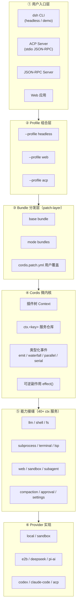
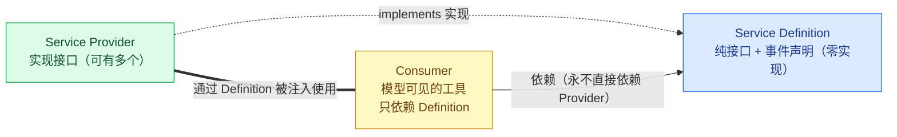
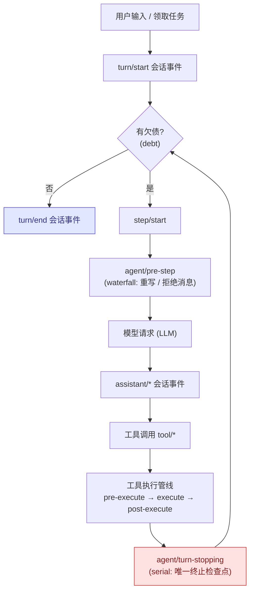

# DeepSeek Harness（dsh）架构深度分析

> 适用对象：希望理解该开源项目架构思想、关键设计、适用场景，并借鉴其模式自建应用的开发者。
> 分析依据：项目 `docs/`、`packages/`、`examples/` 及根目录 `AGENTS.md`、`README.md` 等一手资料。

---

## 一、架构思想

DeepSeek Harness（dsh）的核心架构思想可以概括为一句话：**一切皆插件**。

这不是一句口号——它是一个严格的、可通过代码验证的微内核声明。项目的 extension cookbook 中有一张"功能→机制映射表"，每个产品功能都映射到一个文档化的扩展点上的监听器，没有一行代码修改循环本身。

支撑这一思想的是三个层次的设计哲学：

### 1. Cordis 微内核框架

项目 vendor 了 Cordis 框架（不是 npm 依赖，而是源码内嵌），它的五个核心理念是：

- **插件是实现 `Service` 接口的对象**，挂载到共享 Context 上
- **Context 是服务仓库**，插件通过 `ctx.<key>`（如 `ctx.tools`、`ctx.llm`）找到服务，而非导入具体实现
- **服务依赖通过 `inject` 声明**，加载顺序由依赖关系自动推导
- **类型化事件（Typed Events）**用于插件间通信，有 emit / waterfall / parallel / serial 四种分发模式
- **注册是可逆的副作用（reversible effect）**，卸载时自动回滚

### 2. 组合优于继承

一个运行中的 dsh 是一个插件树，由有序层叠组合而成：

```
Profile（命名组合）→ Bundle（分发格式）→ cordis.patch.yml（用户覆盖）
```

每层可以被上层 patch 替换，没有任何"特权核心"需要打补丁。`dsh --profile web --dump-config` 打印出的每一行都能被你自己的 patch 替换。

### 3. 追加日志作为唯一真相源

模型可见的一切必须从会话日志重建。这是运行时不变量——如果某个输入要到达模型请求，就必须有一条对应的 session event。Fork、resume、transcript、telemetry、persistence 全部从这条事件流派生。

### 整体架构图



---

## 二、关键设计

### 1. 能力接缝（Capability Seam）三角色模式

这是整个架构最精妙的设计。每个可替换能力由三个角色构成：

| 角色 | 职责 | 示例 |
|---|---|---|
| **Service Definition** | 声明接口和事件，纯类型无实现 | `dsh-shell` 声明 `ctx.shell` 接口 |
| **Service Provider** | 实现接口 | `bash-local`、`bash-sandbox`、`pwsh-local` |
| **Consumer** | 使用能力（通常是模型可见的工具） | `tool-bash`、`hooks-claude-code` |

关键在于：**Consumer 依赖 Service Definition，永远不依赖具体 Provider**。所以换一个 Provider（比如从本地 bash 切到 E2B 远程沙箱），fs、subprocess、terminal、lsp 全部自动跟随，不需要改一行 Consumer 代码。

项目中已定义了 40+ 个这样的接缝，覆盖 fs、shell、subprocess、sandbox、web、lsp、subagent、compaction、approval、settings 等能力域。



> 要点：换一个 Provider，Consumer 不需要改一行代码——这就是"一个 provider swap 改变整个产品"的能力。

### 2. Turn / Step 生命周期

执行循环是整个系统的脊柱：

- **Turn** = 零或多个 Step，从输入被领取到不再有欠债（debt）
- **Step** = 一次模型请求 + 它调用的工具

关键设计点：

- `agent/pre-step` 是 waterfall，监听器可以重写或拒绝消息，拒绝仍会记录一个花费 0 step 的 turn
- `agent/turn-stopping` 是 serial 事件，没有 `next()`，是唯一的终止检查点
- `turn/*`、`step/*`、`user/message`、`assistant/*`、`tool/*` 是持久会话事件；其余是实时扩展点



### 3. 工具执行管线

工具调用经过一条多阶段管线，每个阶段都是独立的扩展点：

```
tools/pre-execute   (waterfall: 钩子 / 权限 / 沙箱)
  → monotonic guards   (不可重排的最终拒绝)
  → tools/execute      (waterfall: 超时 / 重试 / 指标)
  → tools/post-execute (waterfall: 接受 / 阻止 / 替换 / 附加上下文)
  → finalizeContent    (内容不变量)
  → tools/result       (同步通知: 冻结的权威结果)
```

这意味着：权限策略、hook 系统、审计、指标收集可以跨工具家族工作，而工具本身不需要知道这些策略的存在。

### 4. 事件分发模式

事件有四种分发模式，是事件契约的一部分：

| 模式 | 是否 await | 分发顺序 | 有返回值 |
|---|---|---|---|
| `emit` | 否 | 注册顺序观察 | 否 |
| `waterfall` | 否 | 注册顺序，around-middleware | 是 |
| `parallel` | 是 | 并行观察 | 否 |
| `serial` | 是 | 注册顺序 | 是 |

`waterfall` 是最重要的：监听器收到 `(...args, next)`，调 `next()` 委托，不调则短路。单决策事件用短路设计。

### 5. 沙箱与权限分层

权限系统横跨三个独立轴：

- **sandbox mode**：read-only / workspace-write / danger-full-access
- **approval policy**：ask / never / unavailable（fail closed）
- **permission preset**：捆绑上述两个旋钮的用户友好层

bash 和 fs 共享同一个沙箱策略根，确保两者不会限制到不同的根目录。

### 6. 子代理委托

`ctx.subagents` 是一个 provider 注册表，支持多种传输：

- `spawn-in-process`：进程内全新子代理
- `fork-in-process`：复用已完成前缀的 fork
- `acp`：ACP JSON-RPC 桥接
- `codex` / `claude-code`：外部产品桥接
- `dsh-sdk`：通过 SDK 连接

子代理可以是 one-shot（一次性）或 continuable（可持续），后者支持 `report` 工具回传消息。

---

## 三、适用场景

### 1. AI 编码代理（核心场景）

项目本身就是 DeepSeek 出品的编码 agent harness，内置 bash/shell、fs 文件操作、LSP 代码导航、终端持久会话等能力。`headless-agent` 示例展示了完整的编码 agent 配置。

### 2. 自动化流水线

ACP（Agent Client Protocol）服务器模式支持 stdio JSON-RPC，可以嵌入 CI/CD 流水线、GitHub Actions 等。`acp-agent` 示例展示了这种用法。

### 3. 多代理编排

workflow 引擎支持模型编写 JavaScript 脚本，脚本中的 `agent()` 调用通过 `ctx.subagents` 扇出到多个子代理。Ralph 工具提供固定消费者路由。适用于需要多步推理、多角色协作的复杂任务。

### 4. 可扩展 AI 平台

由于"一切皆插件"的架构，非常适合作为：

- 自定义 AI agent 平台的基座
- 需要多种 LLM 提供者切换的产品（DeepSeek、Pi-AI、回放测试）
- 需要远程沙箱执行能力的场景（E2B、本地沙箱自由切换）
- 需要深度 hook 定制的场景（Claude Code hook、Codex hook 双桥接）

### 5. SDK 集成

TypeScript SDK 和 Python SDK 通过 JSON-RPC 协议提供 out-of-process 运行时访问，适合在已有应用中嵌入 agent 能力。

---

## 四、开发者如何借鉴这种架构

**借鉴一：微内核 + 事件驱动扩展**
不要在核心循环里写 if/else 分支处理不同功能。把循环设计为事件流（turn/start → step/start → model request → tool execution → step/end → turn/end），让功能通过监听事件挂载。验证标准：你的功能表里每一项都能映射到一个扩展点上的监听器。

**借鉴二：能力接缝三角色分离**
当你在设计一个可替换的能力时，不要只写一个实现类。把三角色分离到不同包/模块：

- **Definition 包**：只有接口和事件声明，零实现代码
- **Provider 包**：实现接口，可以有多个
- **Consumer 包**：使用能力，不知道具体实现是谁

判断标准：换一个 Provider，Consumer 不需要改一行代码。

**借鉴三：追加日志作为状态真相源**
模型可见的状态必须从一条追加日志重建，不能从内存中的可变状态直接读取。这样 fork、resume、replay、telemetry 全部从同一数据流派生，不需要维护多套状态同步机制。运行时断言：如果某个输入到达了模型请求，就必须从日志可重建。

**借鉴四：分层配置组合**
不要用环境变量和 if/else 组合功能。用有序的层叠配置：

```
base bundle → mode bundle → profile patch → home patch → CLI overlay
```

每一层可以替换前一层的任意行配置。这样同一个代码库可以跑出 Web 应用、headless 一次性运行、ACP 服务器等完全不同的形态。

**借鉴五：可逆注册**
所有通过 `ctx.effect()` 或 `ctx.on()` 注册的东西都返回一个 disposer，卸载时自动回滚。这意味着：

- HMR（热模块替换）天然可用
- 插件可以安全地加载和卸载
- 测试可以验证"卸载后所有注册都消失了"

**借鉴六：waterfall 中间件模式**
对于需要拦截和包装的流程（如工具执行前的权限检查），使用 waterfall 而非简单的 before/after 钩子。waterfall 是 around-middleware：监听器收到 `(args, next)`，可以修改参数、短路返回、或调 `next()` 委托。这让策略层可重排、可组合。

**借鉴七：包级约定的强制执行**
项目通过 CI 门控强制执行了大量约定：

- 每个包有 README、有 invariant 检查、有 Model Experience 文档
- 文档有字数预算（architecture.md ≤ 1800 词，AGENTS.md ≤ 1600 词）
- `doc-sync`、`hygiene`、`knip` 等门控确保文档和代码不漂移
- 测试覆盖率要求 100%（per-file on packages）

这种"约定即代码"的纪律性是大型可维护项目的关键。

---

## 五、项目核心数据

| 维度 | 数据 |
|---|---|
| 语言 | TypeScript（ESM everywhere）+ Python SDK |
| 框架 | vendored Cordis（源码内嵌，非 npm 依赖） |
| 包数量 | 90+ 个 `@deepseek-ai/dsh-*` 工作区包，分属 20+ 个分组 |
| 能力接缝 | 40+ 个 `ctx` 服务键 |
| 示例配置 | headless-agent、acp-agent、jsonrpc-agent、web-cordis、web-schedule |
| 测试 | vitest 单元 + 真实 API e2e + 无密钥 snapshot 回放 |
| 许可证 | MIT |

---

## 六、一页速查（借鉴清单）

1. **循环即事件流**：把主流程抽象成事件，功能靠监听挂载。
2. **能力三角色**：Definition / Provider / Consumer 分离，Consumer 永不直接依赖 Provider。
3. **日志即真相**：状态从追加日志重建，fork/resume/replay 同源。
4. **配置即层叠**：base → mode → profile → home → CLI，逐层可 patch。
5. **注册即可逆**：`effect()` 返回 disposer，天然支持 HMR 与测试。
6. **拦截用 waterfall**：around-middleware 可重排、可组合。
7. **约定即代码**：用 CI 门控把架构纪律固化下来。
