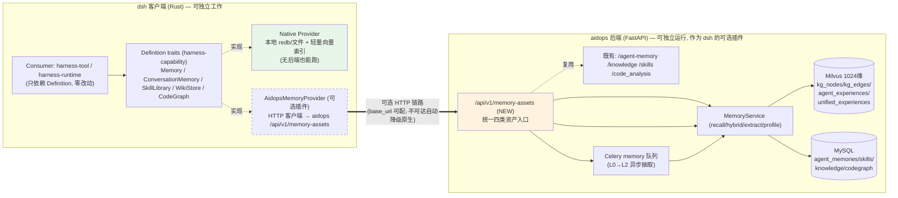

# 双轨记忆架构设计：aidops 作为 dsh 可选后端 + dsh 原生记忆资产

> 范围：本设计文档回答两个核心问题，并给出可落地的架构、接口契约与分期计划。
> 涉及两个仓库：
> - **aidops（智程平台 / AIDevOps Hub）** —— `F:\workspace\ai-dev-ops\aidops-hub-server`（FastAPI 后端，可选后端服务）
> - **dsh（DeepSeek Harness）** —— `F:\workspace\deepseek-aidops-stable`（Rust Agent 客户端，兼原生能力）
>
> 设计思想来源：TencentDB Agent Memory 的四类资产模型（Chat Memory / Skill / Wiki / CodeGraph）+ L0~L3 生命周期。我们**不部署 TencentDB 后端**，而是把其设计思想落到本项目既有底座上。

---

## 0. 对你两个问题的直接回答

### 0.1 问题 1：用 TencentDB Agent Memory 要不要部署后端？能不能用 aidops 当后端？

**要。TencentDB Agent Memory 本身必须部署一整套后端：**
- `MemoryCore`（记忆抽取/检索内核，Node 服务）
- `MemoryProxy`（LLM 流量代理 + 注入/召回，Node 服务）
- `MemoryPanel`（可视化面板，Node 服务）
- 外加 Milvus + Postgres 两个数据依赖

即：**3 个 Node 服务 + 2 个数据库**，运维成本与数据主权都不划算。

**本设计的选择：不部署它，复用 aidops 当后端。** 经代码核查，aidops 已经具备绝大部分底座：

| 能力 | aidops 现状（已存在） |
| --- | --- |
| 向量库 | Milvus 1024 维：`kg_nodes` / `kg_edges`（知识&代码图谱）、`agent_experiences`、`unified_experiences`（统一经验知识湖）、`unified_experiences_archive`（`aidops-hub-server/app/core/milvus/collections.py`） |
| 记忆 | `agent_memories` 表：含 `memory_type`(preference/fact/decision/skill_pattern/bug_pattern/code_pattern)、`memory_scope`(session/project/global)、版本链、遗忘生命周期（`app/models/agent_memory.py`） |
| automemory | `app/core/skillopt/`：`aidops_harvester`（从会话收割）、`aidops_backend`（尝试/判定执行）、`aidops_adopter`、`sleep_runner` —— 即 Skill 资产的自动演化 |
| 知识湖 | `app/api/v1/knowledge.py`、`knowledge_lake.py`、`app/services/knowledge_lake/` |
| 项目管理 | `app/api/v1/projects.py`、`project_repositories.py`、`project_codeloop.py` |
| 代码图谱 | `app/core/code_analysis/graph_*.py`（collector/persist/schema/validator）+ Milvus `kg_nodes/kg_edges` |

**唯一缺口**：L0~L3 分层记忆的生命周期（aidops 的 `layer` 列已**显式废弃**，见 `app/schemas/agent_memory.py:29` 注释 "deprecated: 保留向后兼容，不再用于过滤"），以及**四类资产的统一抽象与面向 dsh 的干净 API**。

因此落地动作是：把 L0~L3 生命周期 + 四类资产统一 API **补进 aidops**，dsh 作为客户端通过 HTTP 通讯。该后端作为 **dsh 的可选插件** —— dsh 不接也能独立工作，aidops 不接 dsh 也能作为平台独立运行。

### 0.2 问题 2：Chat Memory / Skill / Wiki / CodeGraph 是否应在 dsh Rust 原生实现？

**是。** 四类基础能力应在 dsh 用 Rust 原生实现（保证 dsh 无后端也能独立工作），同时通过**可选插件 Provider** 与 aidops 后端同步/卸载。

dsh 已有的 `Memory` 能力接缝（`harness-capability/src/memory.rs`：三角色 Definition/Provider/Consumer，零实现 Definition）正好是这个"可插拔"哲学的载体——新增 `AidopsMemoryProvider` 实现同一组 Definition，`Consumer`（harness-tool/runtime）零改动即可在"原生↔aidops"之间切换。

---

## 1. 现状能力对照（差距即机会）

| 资产类型 | aidops 现状 | dsh 现状 | 补齐动作 |
| --- | --- | --- | --- |
| **Chat Memory**（L0~L3） | `agent_memories` 有 type/scope/版本链/遗忘，但 **无 L0~L3 成熟度轴**（`layer` 已废弃） | `Memory` trait 仅扁平 KV（scope+key+value，朴素子串检索） | aidops 加 `lifecycle_layer` 列 + 抽取管线；dsh 加 `ConversationMemory` 原生资产 |
| **Skill**（可执行经验） | **强**：`skills` + `skillopt`(harvester/backend/adopter) + 候选/晋升/演化日志/使用日志 | 无 | dsh 加 `SkillLibrary` 原生资产，与 aidops skills 双向 sync |
| **Wiki**（结构化页面+链接图谱） | 有 `knowledge` + `knowledge_lake` + `kg_nodes/kg_edges`（图谱已存在，但未显式化为 Karpathy "LLM Wiki" 页面） | 无 | aidops 显式化 link graph；dsh 加 `WikiStore` 原生资产 |
| **CodeGraph**（符号/文件/调用/影响路径） | **强**：`code_analysis/graph_*` + Milvus `kg_nodes/kg_edges` | 无 | dsh 加 `CodeGraph` 原生资产（轻量本地版） |
| **向量后端** | Milvus 1024 维（生产级） | 无（朴素子串） | dsh 原生用本地轻量索引；aidops 走 Milvus |

**结论**：aidops 已具备 ~80% 底座；最关键缺口是 **L0~L3 生命周期** + **四类资产的统一抽象/API** + **dsh 原生四类资产**。这正是本设计要补的三件事。

---

## 2. 统一记忆资产模型（借鉴 TencentDB 设计思想，落到本项目语义）

### 2.1 四类资产（Asset）

| 资产 | 含义 | 核心字段 | 本项目落点 |
| --- | --- | --- | --- |
| **ChatMemory** | 偏好、事实、决策、交互历史 | 偏好/事实/决策/对话 episode；`lifecycle_layer` L0~L3 | aidops `agent_memories`（扩展）；dsh `ConversationMemory` |
| **Skill** | 可执行经验 | `version`、`trigger_boundary`（触发边界/适用条件）、`steps`（执行步骤）、`verification_rules`（验证规则）、`resource_files`（资源文件） | aidops `skills` + `skillopt`；dsh `SkillLibrary` |
| **Wiki** | 文档→结构化页面 + 链接图谱（Karpathy "LLM Wiki"） | `page`（结构化块）、`links`（页面间有向边）、`backlinks` | aidops `knowledge`/`knowledge_lake` + `kg_nodes/kg_edges`；dsh `WikiStore` |
| **CodeGraph** | 代码符号、文件、调用关系、影响路径 | `symbol`、`file`、`call_relations`、`impact_paths` | aidops `code_analysis/graph_*` + `kg_nodes/kg_edges`；dsh `CodeGraph`（轻量） |

### 2.2 L0~L3 生命周期（核心新增，TencentDB 思想）

L0~L3 是 **ChatMemory 的"成熟度轴"**，描述一条对话记忆从原始到沉淀的演化：

| 层级 | 名称 | 含义 | 典型存储 | 生命周期动作 |
| --- | --- | --- | --- | --- |
| **L0** | Working 工作记忆 | 当前会话原始上下文、最近若干 turns，进程内/超短期 | 内存 ring buffer | 会话结束即清 |
| **L1** | Episodic 情景记忆 | 单次会话提炼的 episode / 交互摘要 | 短期（带 TTL） | 去重合并 → L2 |
| **L2** | Semantic 长期语义 | 合并去重后的事实、偏好、决策（`is_static=1`） | 持久（MySQL + 向量） | 矛盾检测、版本链、遗忘 |
| **L3** | Procedural/Asset 程序性资产 | 沉淀为 **Skill / Wiki / CodeGraph** 可执行/结构化资产 | 持久 + 强校验 | 晋升、演化、ACL |

> **重要澄清**：aidops 废弃的 `core/technical/strategic` `layer` 是"**主题抽象轴**"，与 L0~L3 "**成熟度轴**"**正交**——二者不冲突，可并存（新列 `lifecycle_layer` 专指 L0~L3，旧 `layer` 列保留不动以兼容历史数据）。

### 2.3 统一 API 契约（aidops 暴露给 dsh 的 `/api/v1/memory-assets`）

设计一套**统一资产入口**，让 dsh 一个 HTTP 客户端覆盖四类资产：

| 方法 & 路径 | 作用 |
| --- | --- |
| `POST /memory-assets/recall` | 统一召回：按 `asset_type` + `query` + `project_id` + `scope`，跨四类返回 TopK（对标 aidops 既有 `hybrid_recall`） |
| `POST /memory-assets/ingest` | 统一写入：ChatMemory/Skill/Wiki/CodeGraph 任一种（内部路由到对应表/集合） |
| `GET  /memory-assets/{asset_type}/{id}` | 读取单条资产 |
| `POST /memory-assets/{asset_type}/{id}/forget` | 遗忘/归档（触发版本链与 `is_forgotten`） |
| `POST /memory-assets/extract` | 异步抽取 L0→L2（投递 Celery `memory` 队列，对标 TencentDB pipeline） |
| `GET  /memory-assets/profile` | 当前 project/user 的 Loadout 画像（静态+动态双层） |
| `POST /memory-assets/sync` | dsh 原生 ↔ aidops 双向同步（带版本向量/ETag） |

鉴权复用 aidops 既有 JWT（`get_current_user`），dsh 以 **service account / API Key** 身份调用；CORS 已 `allow_origins=["*"]`（`app/main.py:427`），本地联调零障碍。基础路径为 `settings.API_PREFIX`（默认 `/api`），健康检查 `/api/health`。

### 2.4 aidops 侧最小数据模型改动

- `agent_memories` 增加列 `lifecycle_layer VARCHAR(8) DEFAULT 'L2'`（与废弃 `layer` 并存，不破兼容）。
- 新增轻量聚合层 `app/api/v1/memory_assets.py`：在既有 `MemoryService`（recall/hybrid_recall/extract_from_dev_contexts/get_profile）之上封装四类资产的统一入口，**不重写既有 service**。
- Skill/Wiki/CodeGraph 复用现有 `skills`、`knowledge`、`kg_nodes/kg_edges` 表，仅通过 `memory-assets` 路由统一暴露。

---

## 3. 双轨架构

### 3.1 总体架构（Mermaid）



**解耦要点**：
- dsh 未配置 `aidops.base_url` → 仅用 `Native Provider`，纯本地，零外部依赖。
- aidops 不接 dsh → 作为完整 AIOps 平台独立运行（记忆/知识/技能/项目管理照常）。
- 二者通过**统一 `memory-assets` API + 版本化 sync** 解耦，互不可知内部实现。

### 3.2 dsh 原生侧（Rust）

扩展 `harness-capability/src/memory.rs` 的 Definition 层，新增四类资产 Definition（继续三角色：Definition/Provider/Consumer）：

```rust
// 新增 Definition（零实现），沿用现有 Any 超 trait 模式
pub trait ConversationMemory: Any + Send + Sync {
    fn record(&self, turn: ConversationTurn) -> Result<()>;        // L0 写入
    fn consolidate(&self, session_id: &str) -> Result<Vec<MemoryEntry>>; // L1→L2
    fn recall(&self, query: &str, layer: LifecycleLayer) -> Result<Vec<MemoryEntry>>;
}
pub trait SkillLibrary: Any + Send + Sync {
    fn register(&self, skill: Skill) -> Result<()>;   // 含 version/trigger/steps/verify/resources
    fn match_trigger(&self, ctx: &Context) -> Result<Vec<Skill>>;
    fn verify(&self, skill_id: &str, result: &ExecResult) -> Result<f32>;
}
pub trait WikiStore: Any + Send + Sync { /* page + link graph */ }
pub trait CodeGraph: Any + Send + Sync { /* symbol/file/call/impact */ }

pub enum LifecycleLayer { L0, L1, L2, L3 } // 成熟度轴，与主题轴无关
```

**两个 Provider 实现同一组 Definition**：
- `NativeMemoryProvider`：本地 `redb`/文件 + 轻量向量索引（如 `sqlite-vec` 或本地 small-embedding + 余弦），满足 dsh 离线可用。
- `AidopsMemoryProvider`：HTTP 客户端，调用 `/api/v1/memory-assets/*`，将 Definition 方法映射为 REST 调用。

通过 `AppContext` 注册其中之一（或组合），**Consumer 完全不变**——满足既有不变量"换 Provider 不改 Consumer"。

### 3.3 aidops 后端侧（可选后端）

- 新增 `app/api/v1/memory_assets.py`：薄封装层，复用 `MemoryService` 既有 `recall / hybrid_recall / extract_from_dev_contexts / get_profile`，扩展 `lifecycle_layer` 过滤与四类资产聚合。
- 异步抽取走既有 Celery `memory` 队列（`AGENTS.md` 已声明 worker 消费 `memory` 队列）。
- Milvus 继续作为统一向量后端（1024 维，与现有集合一致），`unified_experiences` 知识湖天然可作 L2/L3 的统一向量空间。

---

## 4. 接口契约示例（dsh ↔ aidops）

**统一召回** `POST /api/v1/memory-assets/recall`
```json
{
  "project_id": 7,
  "query": "登录接口如何做幂等?",
  "asset_types": ["chat_memory", "skill", "wiki", "code_graph"],
  "scope": "project",
  "min_layer": "L2",
  "top_k": 8
}
```
响应（与既有 `HybridRecallResponse` 对齐）：
```json
{ "query": "...", "results": [
  { "asset_type": "skill", "id": "sk_123", "score": 0.91,
    "payload": { "title": "幂等登录", "trigger_boundary": "...", "steps": [...] } }
], "profile": { "static": [...], "dynamic": [...] } }
```

**统一写入** `POST /api/v1/memory-assets/ingest`
```json
{ "asset_type": "chat_memory", "project_id": 7, "scope": "project",
  "lifecycle_layer": "L2", "memory_type": "decision",
  "title": "登录采用 Redis 令牌桶限流", "content": "...", "confidence": 0.9 }
```

**降级契约**：dsh 调用 aidops 超时/不可达时，`AidopsMemoryProvider` 返回 `Err(BackendUnavailable)`，dsh 自动回落 `Native Provider`，并在 `SessionLog` 记录降级事件（失败可见性）。

---

## 5. 分期实施计划（P0~P4）

| 阶段 | 目标 | 关键交付 | 依赖 |
| --- | --- | --- | --- |
| **P0** | 打通"可选插件"链路 | dsh 定义四类资产 Definition 骨架；aidops `memory_assets.py` 最小实现（ChatMemory recall/ingest + `lifecycle_layer` 列 + Alembic 迁移）；dsh `AidopsMemoryProvider` 跑通原生↔aidops 切换 | 无 |
| **P1** | dsh 原生四类资产 + aidops L0→L2 抽取 | `NativeMemoryProvider` 完整实现；aidops `extract` 异步管线（L0→L2，复用 `extract_from_dev_contexts`） | P0 |
| **P2** | Skill 资产对齐 | dsh `SkillLibrary` ↔ aidops `skills`/`skillopt` 双向 sync（version/trigger/steps/verify/resources） | P1 |
| **P3** | Wiki + CodeGraph 资产 | dsh `WikiStore`（结构化页面+链接图谱）/`CodeGraph`（轻量本地）↔ aidops `knowledge`/`code_analysis` | P1 |
| **P4** | Loadout/ACL/跨项目/Hub 协同/可观测 | Profile 画像、项目级 ACL、跨项目共享、TencentDB Hub 风格远程协同、指标 | P2/P3 |

---

## 6. 风险与权衡

| 风险 | 缓解 |
| --- | --- |
| **双写一致性**（dsh 原生 ↔ aidops） | `sync` 接口带版本向量/ETag + Last-Write-Win；以 `source_ref` 溯源；关键资产走事件日志 |
| **aidops 不可用** | dsh 必须有原生兜底（降级契约 §4），记忆能力不中断 |
| **向量维度对齐** | aidops Milvus 固定 1024；dsh 原生可用独立轻量 embedding（如 384）或本地 1024 模型，sync 时以文本+ID 对齐而非向量 |
| **多租户/鉴权** | 复用 aidops 既有 JWT + `project_id` 隔离；dsh 用 service account |
| **主题轴 vs 成熟度轴混淆** | 明确 `layer`(废弃/主题) 与 `lifecycle_layer`(L0~L3/成熟度) 并存，文档与 schema 注释写清 |

---

## 7. 架构决策记录（ADR）

- **ADR-1**：不部署 TencentDB 后端，复用 aidops。理由：成本/运维/数据主权；aidops 已具 80% 底座。
- **ADR-2**：L0~L3 作为 ChatMemory 的**成熟度轴**，与废弃的 `layer` 主题轴**正交并存**，新增 `lifecycle_layer` 列。
- **ADR-3**：四类资产统一走 `/api/v1/memory-assets` 单一入口，降低 dsh 客户端复杂度。
- **ADR-4**：dsh 侧严格使用 Definition/Provider/Consumer 三角色，保证"可选插件"可插拔、Consumer 零改动。

---

## 8. 可直接执行的下一步（P0 最小改动清单）

**aidops 侧**
1. `app/models/agent_memory.py`：`AgentMemory` 增加 `lifecycle_layer` 列（默认 `"L2"`，注释说明与 `layer` 正交）。
2. `app/schemas/agent_memory.py`：`AgentMemoryCreate`/`Read` 增加 `lifecycle_layer` 字段。
3. 新建 `app/api/v1/memory_assets.py`：实现 `/recall`、`/ingest`、`/profile` 最小路由，复用 `MemoryService`。
4. `app/api/v1/router.py`：`include_router(memory_assets_router)`。
5. Alembic 迁移新增列。

**dsh 侧**
1. `harness-capability/src/memory.rs`：新增 `ConversationMemory`/`SkillLibrary`/`WikiStore`/`CodeGraph` Definition + `LifecycleLayer` 枚举。
2. 新建 `harness-provider-aidops/`（或并入 `harness-provider-memory`）：实现 `AidopsMemoryProvider`，`base_url`/`api_key` 从配置读取，缺失则整体禁用。
3. `harness-runtime` 注册：当配置存在 `aidops.base_url` 时装配 `AidopsMemoryProvider`，否则用原生 `FileMemory`/新 `NativeMemoryProvider`。

---

> 附：上一版设计文档 `docs/integrate-tencentdb-agent-memory-design.md`（TencentDB 直接外挂方案）可作为对比参考；本方案已将其"零代码外挂"思路升级为"以 aidops 为自研后端 + dsh 原生双轨"，更契合你对数据主权与可独立运行的诉求。
