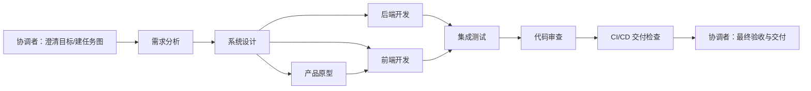
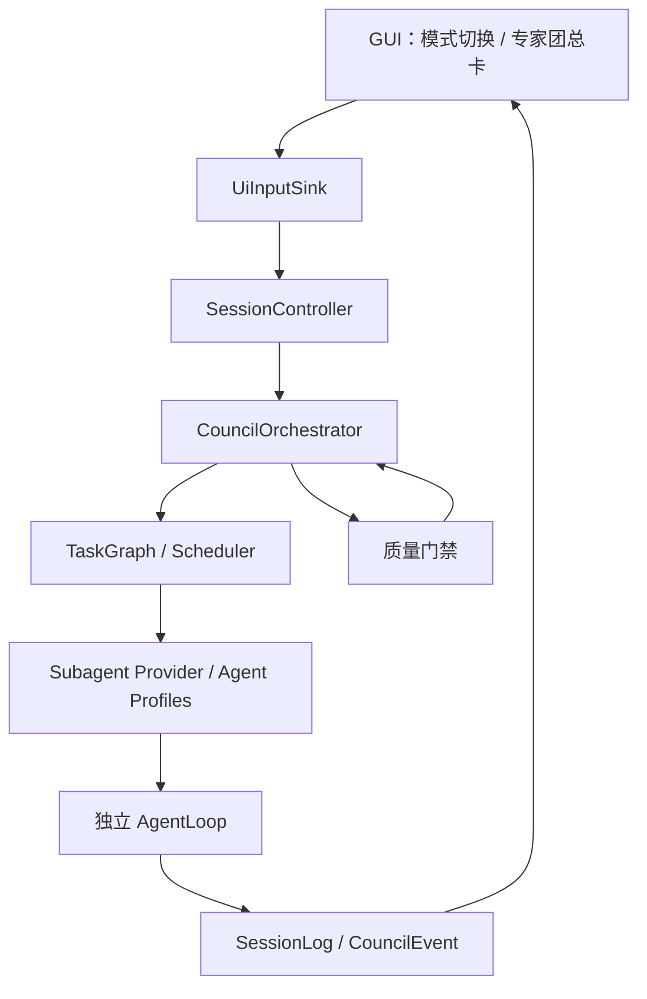

# 专家团协同模式：系统设计评审稿

> 状态：**Phase 1-3 首版已实施**
> 目标版本：`0.2.0`
> 决策：保留现有“标准模式”为默认；新增可显式切换的“专家团模式”。

## 1. 问题与目标

现有 `delegate` 能力可由单个 Agent 临时委派子任务，但没有任务图、角色选择、依赖控制、共享产物协议或最终交付门禁。因此不适合稳定地完成跨需求、设计、开发、测试、评审与发布的大型任务。

专家团模式要让一个协调者（Coordinator）围绕同一目标组织多个专业 Agent：

- 自动把目标拆为有依赖关系的任务图（DAG），明确哪些串行、哪些并行；
- 根据任务类型、风险、所需工具和当前负载选择最合适的专家；
- 共享同一项目上下文、任务状态和经过审核的产物，但不共享不受控的私有思考；
- 保证写入同一工作区的任务不会并发冲突；
- 通过测试、审查和交付清单后，才给出“已完成”的最终结论；
- 所有状态都落在会话事件流，可恢复、可重放、可审计。

非目标：首版不承诺无限并发、自治发布生产环境、跨机器分布式调度，也不把模型的私有思考链保存为共享数据。

## 2. 用户体验

### 2.1 模式切换

输入框附近提供模式选择：`标准`（默认） / `专家团`。切换只影响**之后新建的任务**；正在运行或排队的任务维持创建时的模式，避免中途改变执行语义。

专家团任务提交后，对话中显示一张固定的“专家团任务”总卡：

- 目标、当前阶段、总体进度、运行时长、风险/阻塞项；
- 任务图概览：待执行、执行中、已完成、失败、等待人工确认；
- 每个任务显示专家角色、依赖、产物链接及状态；
- 仅展示协调者摘要；每位专家的工具与思考过程继续默认折叠；
- 用户可展开查看任务明细、暂停/恢复未开始任务、取消整团任务，以及在门禁处批准继续。

### 2.2 示例：交付一个新项目



其中 `D` 与 `E` 可并行；`F` 依赖原型和接口契约；`G` 只能等待前后端完成。协调者只在依赖满足且资源许可时派发任务。

## 3. 角色与职责

| 角色 | 主要职责 | 默认可写范围 | 交付物 |
|---|---|---|---|
| 协调者 | 澄清、规划、调度、冲突处理、验收 | 不直接改业务文件；可维护任务图 | 计划、状态摘要、最终交付报告 |
| 需求分析师 | 范围、验收标准、风险 | `docs/requirements/` | 需求与验收文档 |
| 系统设计师 | 架构、接口、数据与非功能约束 | `docs/design/` | 架构/接口设计 |
| 产品原型师 | 信息架构、交互与原型说明 | `docs/product/`、原型目录 | 原型与交互说明 |
| 开发专家 | 前端、后端、基础设施实现 | 任务声明的代码路径 | 代码与局部测试 |
| 测试专家 | 测试策略、自动化、回归 | `tests/`、测试报告目录 | 测试报告 |
| 代码审查员 | 正确性、安全、可维护性审查 | 默认只读 | 审查结论与阻断项 |
| CI/CD 专家 | 构建、流水线、发布前校验 | CI 配置路径 | 可复现流水线与交付清单 |

角色是能力画像而不是固定人名。实现中的 `AgentProfile` 由能力标签、允许工具、写入范围、最大并发、历史成功率和模型配置组成；协调者可选择现有最佳画像，而非硬编码某个 Agent。

## 4. 核心模型与调度

### 4.1 任务图

每个专家团任务有一个不可变 `council_id` 和一个可增量更新的 DAG：

```text
CouncilRun
  id, parent_session_id, goal, mode=ExpertCouncil
  tasks: Map<TaskId, CouncilTask>
  artifacts: Map<ArtifactId, Artifact>
  gates: Vec<QualityGate>

CouncilTask
  id, title, objective, role, required_capabilities
  depends_on: Vec<TaskId>
  state: Draft | Ready | Running | Blocked | Review | Done | Failed | Cancelled
  write_scopes, expected_artifacts, acceptance_criteria
  assigned_agent, attempt, lease, summary, evidence
```

任务图必须无环。计划生成后先经过本地校验（ID 唯一、依赖存在、无环、每项均有验收条件），才允许派发。

### 4.2 调度算法

协调者每次状态变化后执行一次确定性调度循环：

1. 找出依赖全部 `Done`、未被暂停且未超过重试上限的 `Ready` 任务；
2. 依据写入范围做资源锁定：两个有重叠写入范围的任务不得并行；只读任务可并行；
3. 按 `角色匹配 > 必需能力 > 允许工具/权限 > 空闲度 > 历史质量 > 成本` 为任务选择 Agent；
4. 在全局并发上限、每角色上限和预算上限内并行派发；
5. 任务完成后验证预期产物与证据，满足则解锁下游；不满足则转 `Blocked` 或有限重试；
6. 无可运行任务且未完成时，协调者只报告明确阻塞原因，绝不静默停滞。

首版推荐默认：最大 3 个并行专家、单工作区最多 1 个代码写入任务、每任务最多 2 次重试。配置由用户可见且可调整。

### 4.3 共享协作边界

共享内容仅包括：目标、已批准计划、依赖任务的摘要与产物、接口契约、代码变更、测试/审查证据和协调者决策。每位专家仍有自己的消息与工具事件流；私有思考不跨 Agent 传播。

专家启动时收到“共享上下文快照”，包含其任务说明、上游已验收产物及写入范围。专家完成时必须返回结构化结果：`summary`、`artifacts`、`changed_paths`、`tests`、`risks`、`handoff_notes`。协调者只读取这一结果和经允许的产物，防止上下文无限膨胀。

## 5. 质量门禁与最终交付

协调者不能仅因所有子任务返回成功就结束。默认门禁为：

1. 需求与设计任务均有明确验收标准；
2. 所有计划任务已 `Done`，或被用户显式豁免并记录原因；
3. 受影响的构建/测试通过；
4. 代码审查不存在未解决的阻断问题；
5. CI/CD 任务生成可复现的构建或明确说明未授权的外部发布步骤；
6. 产物清单、已知限制和验证证据齐全。

对于破坏性操作、外部部署、付费服务调用、不可逆迁移等，流程进入 `AwaitingApproval`，必须由用户点击批准。协调者没有绕过此门禁的权限。

## 6. 架构与持久化

现有架构中 `SessionLog` 是会话真相源，`Subagent` 是能力接缝，`DelegateTool` 是模型可见的临时委派入口。专家团模式不应让 UI 直接调度 Agent，而应新增运行时编排器。



建议新增但不破坏原 `SessionEvent` 的事件族：

- `CouncilStarted`、`CouncilPlanCreated`、`CouncilTaskStateChanged`；
- `CouncilAgentAssigned`、`CouncilArtifactPublished`、`CouncilGateEvaluated`；
- `CouncilBlocked`、`CouncilCompleted`、`CouncilCancelled`。

事件应带 `council_id`、`task_id`、`parent_task_id` 和时间戳。`SessionLog` 可据此恢复总卡和重建任务图；专家自身的详细会话可按 `council_id/task_id` 分流保存，避免污染主会话上下文。

建议 crate 落点：

| 层 | 改动 |
|---|---|
| `harness-session` | `CouncilEvent`、任务图快照/重放和产物索引 |
| `harness-capability` | `AgentProfile`、`CouncilScheduler`、结构化 `SubagentResult` trait |
| `harness-runtime` | `CouncilOrchestrator`、DAG 校验、调度、锁/租约、门禁评估 |
| `harness-tool` | 专家团专用的 `council_plan` / `council_status` 工具；保留 `delegate` 兼容标准模式 |
| `harness-ui` | 模式切换、任务总卡、状态/证据视图、暂停取消与审批按钮 |
| `harness-bin` | 组装默认专家画像与配置 |

## 7. 失败、恢复与安全

- Agent 失败、超时或输出不合格：任务转 `Blocked`；协调者最多按策略重试，之后请求用户决策；
- Agent 失联：其租约过期后任务可安全重新派发；写入任务在重新派发前必须检查工作区差异与上次产物；
- 写入冲突：调度前锁定声明路径；运行中检测到范围外写入时任务失败并进入审查；
- 队列公平：专家团与标准任务共享全局资源，但专家团内部优先满足依赖关键路径，不能饿死普通对话；
- 安全策略：每个 Agent 继承全局权限的更严格子集；协调者不能借由委派扩大 shell、文件、网络或部署权限；
- 成本控制：记录每任务 token、时间和重试次数，达到预算后停止新任务并报告。

## 8. 分阶段实施与验收

### Phase 1：可靠核心

实现模式持久化、任务图、事件、确定性 DAG 调度、最多 3 个 in-process Agent、只读/写入路径锁与主会话总卡。验收：模拟任务图可证明串并行顺序正确、重启可恢复、取消不会启动未开始任务。

### Phase 2：角色与共享产物

实现画像选择、结构化任务结果、共享上下文快照、产物/证据索引和阻塞处理。验收：需求→设计→开发→测试流程只向下游传递已验收产物，且并行写冲突被拒绝。

### Phase 3：质量门禁与可观测性

实现测试/审查/CI 门禁、审批界面、成本与关键路径视图。验收：测试失败或审查阻断时不得产生“已完成”；所有最终结论可追溯到任务与证据。

### Phase 4：外部/可扩展专家（可选）

开放插件提供 `AgentProfile` 或远程 `Subagent`，并增加签名、权限声明和健康检查。该阶段不在首版范围。

## 9. 评审决策点

请评审并确认以下问题后实施：

1. “每个代码写入范围同一时刻只允许一个专家”是否作为首版硬规则？
2. 默认最大并发 3 是否符合本地机器和模型配额？
3. 最终交付是否强制要求代码审查与测试门禁，还是允许按任务类型选择？
4. Superpowers 是否改为“系统技能包”而不参与专家画像，还是要作为一个可启停的专家能力包？
5. 是否接受 Phase 1 先使用进程内专家，后续再接入插件/远程专家？

## 10. 当前实现说明

首版已经接入 `CouncilOrchestrator`，并提供以下可运行闭环：

- GUI 输入区可显式切换“标准 / 专家团 DAG”，模式随排队任务一起固化；
- 本地复杂度路由生成最小任务图：纯分析 2 节点、小改动 3 节点、标准改动 5 节点、高风险改动 7 节点；
- 本地 DAG 唯一 ID、依赖存在、无环和验收条件校验；
- 默认最多 3 个并行专家（`HARNESS_COUNCIL_MAX_PARALLEL` 可调整）、写入范围冲突锁、失败自动重试一次；
- 任务状态、产物摘要、证据、阻塞/取消和门禁结果全部追加到 `SessionLog`；
- 默认执行任务完整性、测试、审查、证据完整性四项门禁，任一失败都不会宣告完成；
- GUI 总卡实时显示进度、运行节点、角色、依赖、尝试次数、证据与门禁；
- 用户取消会阻止后续节点启动；异常退出恢复时将专家团标记为已取消并明确提示，不会盲目重放可能有副作用的写入任务。
- 工具结果按类型压缩（Shell 6K、普通工具 8K、文件正文 16K 字符），重复行折叠并保留长输出头尾；
- 每次模型请求应用默认 48K 字符上下文预算，从完整用户回合边界裁剪并生成轻量旧历史摘要。

首版使用进程内专家。外部插件专家、跨机器调度和需要人工批准的生产部署仍属于后续扩展范围。
