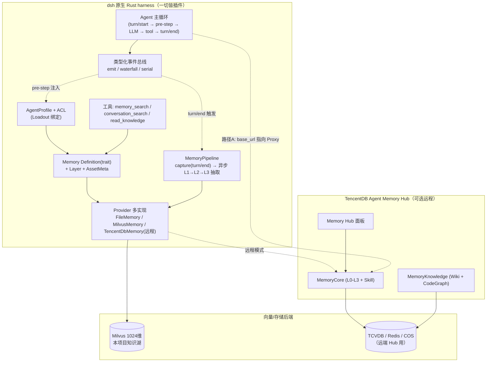

# 借鉴集成 TencentDB Agent Memory 到 deepseek-aidops-stable 的设计与实施草案

> 调研依据：`F:/src/ai/tool/TencentDB-Agent-Memory`（v2.0.1-beta）一手源码与文档；
> 目标项目：`F:/workspace/deepseek-aidops-stable`（DeepSeek Harness 原生 Rust 版，下称 dsh）。
> 配套资料：本仓库 `docs/system-design-completion.md`、`docs/deepseek-harness-architecture-analysis.md`、`docs/native-rust-agent-harness-design.md`。

---

## 0. 结论速览（TL;DR）

1. **两项目天然互补**：dsh 是 TencentDB Agent Memory 官方支持的 Agent 之一，Proxy 已内置 `/dsh/<spaceId>` 路由。dsh 的 `base_url` 完全可配（见 §4.1），因此 **Proxy 零代码外挂记忆层当天即可跑通**。
2. **当前 dsh 的记忆能力明显单薄**：`Memory` trait 是扁平 KV 文件记忆（`FileMemory`，朴素子串检索），**没有 L0–L3 分层、没有异步抽取管线、没有 Skill/Wiki/CodeGraph 资产、没有 Loadout/ACL**。这正是 TencentDB 项目的核心设计思想。
3. **可借鉴度：高，且与 dsh "一切皆插件" 哲学同构**。TencentDB 的四条记忆资产（Chat Memory / Skill / Wiki / CodeGraph）、分层生长、Loadout+ACL、按需工具调用，都能映射进 dsh 已有的 `Definition / Provider / Consumer` 三角色能力接缝与事件总线，**不改动主循环**。
4. **推荐双轨**：先走 **路径 A（Proxy 外挂）** 当天验证价值；再走 **路径 B（原生设计移植）** 把思想落进 dsh 能力接缝，并以本项目已有的 **Milvus 知识湖** 作为向量后端，最终形成混合架构（§4.3）。

---

## 1. TencentDB Agent Memory 设计思想提炼

### 1.1 核心命题

> "让下一个 Agent 少走弯路的信息，都应该被保存、组织、复用。" —— 记忆不只是"记住对话"。

它把 Agent 的产出物当成**会复利增长的公司资产**来管理，而不是聊天记录仓库。

### 1.2 四类记忆资产（Memory Asset）

| 资产 | 保存什么 | 在 dsh 中的对应缺口 |
| :-- | :-- | :-- |
| **Chat Memory** | 偏好、事实、决策、交互历史（L0→L3 分层） | 仅有扁平 KV，无分层 |
| **Skill** | 可执行经验（带版本、触发边界、执行步骤、验证规则、资源文件） | 无 |
| **Wiki** | 文档→结构化页面 + 链接图谱（Karpathy "LLM Wiki" 思想） | 无 |
| **CodeGraph** | 代码符号、文件、调用关系、影响路径 | 无 |

### 1.3 L0–L3 分层生长模型

对话先作为 **L0 原始对话** 保存，再由异步 Pipeline 提炼为不同粒度：

| 层级 | 保存什么 | 主要用途 |
| :-- | :-- | :-- |
| **L0 Conversation** | 原始对话与完整上下文 | 核对原话、时间、来源 |
| **L1 Atom** | 从对话提取的事实、偏好、约束、事件 | 精确召回可执行信息 |
| **L2 Scenario** | 围绕项目/场景组织的知识块 | 快速恢复一个工作场景 |
| **L3 Core / Persona** | 长期画像、稳定模式、高层认知 | 让 Agent 迅速进入语境 |

- **生成与召回都分层**：平时用 L2/L3 快速进入语境；需要具体事实时通过 BM25 + 向量检索 + RRF 回到 L1/L0。
- 结果经过**条数、字符预算、超时限制**，避免记忆反噬上下文。

### 1.4 Proxy 零代码接入（capture / recall 机制）

Proxy 是整套设计的精华：Agent 的 `base_url` 指向 Proxy，协议不变，**零插件、零 Hook、零 MCP**。

- **拦截点**：OpenAI 兼容的 `/chat/completions`。
- **`InjectionPipeline`**：`raw body → Adapter.parse() → AgentContext → executeHooks → Adapter.serialize() → modified body`。
- **注入点（InjectionPoint）**：`system.prefix` / `system.suffix` / `system.before_tools` / `system.after_tools` / `user.first_turn` / `user.before` / `user.after` / `tools.append` / `tools.prepend`。
- **Recall Hook**：并行调用 `searchAtomic + readCore + listScenarios`，格式化为 `Persona + L1 记忆 + Scene Navigation + 工具引导` 注入 system。
- **Capture Hook**：`agent_end` 时 `addConversation()`，后台异步完成 L1→L2→L3 抽取（Pipeline Worker）。
- **缓存策略**：`none / session_init / hybrid`，按 `session_id` 隔离，避免每轮重算。

### 1.5 Loadout + ACL（记忆不是全局 Prompt，而是 Agent 的"装备"）

所有资产统一登记为 **Memory Asset**，Hub 通过 **Fixed Binding + ACL** 决定某个 Agent 能带走哪些资产：
- 先按 Team / User / Agent / 可见性缩小权限范围，再按当前问题召回。
- 可见性：`private`（仅 Owner）/ `team`（全队）/ `restricted`（User/Role/Agent ACL）/ `agent`（定向装配）。
- 结果：团队共享经验而不共享隐私；换 Agent / 换框架只需重新装配，不必重新训练。

### 1.6 知识按需调用（tools/list + tools/call）

Wiki / CodeGraph 平时只是**可用工具**，只有真正需要时（`/v3/tools/list` 发现 → `/v3/tools/call` 读取页面/源码/影响路径）才进上下文。这避免了"整库注入"。

### 1.7 冷启动：先读档，再开工

支持导入已有 **代码库**（CodeGraph 自动索引）、**文档/文件**（Wiki 自动生成）、**历史 Session**（Skill 与 Chat Memory 自动提取）。新 Agent Team 从现有经验开始，不必从头学习。

### 1.8 技术栈与数据面

| 维度 | 选型 |
| :-- | :-- |
| 语言/运行时 | Node ≥ 22.16（MemoryCore / Proxy / MemoryKnowledge / MemoryPanel 均为 TS） |
| 存储 | TCVDB（向量）+ COS（文件）+ Redis（状态）；ClickHouse（遥测） |
| 客户端 | OpenClaw 插件 / Hermes 插件；SDK（Python + TypeScript，零框架依赖） |
| 数据面 API | v3 REST：conversation / atomic / scenario / core CRUD+Search；skill CRUD+extract；tools/list+call |
| Benchmark | PersonaMem 48% → 76%（+59%） |

**关键架构启示**：核心逻辑全部下放为"远端 Gateway + 独立 SDK"。本地插件只做**框架适配层**（hooks + tools + prompt 注入），数据操作全部委托 SDK。这与 dsh 的"能力接缝三角色"如出一辙。

---

## 2. 当前 deepseek-aidops-stable（dsh）现状

### 2.1 架构（微内核 + 能力接缝 + 事件总线 + 可逆注册）

- `harness-core`：AppContext（TypeMap）+ 类型化事件总线（emit / waterfall / parallel / serial）+ `Registration` 可逆副作用 + `Plugin::deps()` 拓扑组合 + `ExtensionPoint` 枚举。
- `harness-capability`：纯 trait 的 Definition（Shell / Fs / Editor / Lsp / Subagent / Compaction / **Memory** / Hook / Git）。
- `harness-provider-*`：各 Definition 的 Provider 实现 + Consumer 只依赖 trait。
- `harness-session`：`SessionLog` 追加日志为唯一真相源（fork/resume/replay 全派生）。
- `harness-runtime`：tokio 编排 + Agent 循环 + 工具管线；事件：`agent/pre-step`（waterfall）、`turn/end`（serial）、`tool/*`。

### 2.2 Memory 现状（仅扁平 KV）

```rust
// harness-capability/src/memory.rs
pub trait Memory: Any + Send + Sync + 'static {
    fn write(&self, entry: MemoryEntry) -> Result<()>;     // scope+key upsert
    fn read(&self, scope: MemoryScope) -> Result<Vec<MemoryEntry>>;
    fn search(&self, query: &str) -> Result<Vec<MemoryEntry>>; // 朴素子串
}
// MemoryScope: Project / User / Session
```

`FileMemory` 落盘 `<root>/.harness-memory/<scope>/<key>`，`search` 是三级 scope 朴素子串匹配。**无分层、无抽取、无 Skill/Wiki/CodeGraph、无 ACL、无 Loadout、无异步管线。**

### 2.3 记忆相关接入点（改造友好的现有接缝）

| 接缝 | 位置 | 用途 |
| :-- | :-- | :-- |
| `ExtensionPoint::Memory` | `harness-core/src/extension.rs` | 记忆能力扩展点（已声明） |
| `harness-provider-memory::FileMemory` | 已实现 | 可替换为向量库 Provider 而不改 Consumer |
| `agent/pre-step`（waterfall） | 运行时 | 注入记忆的最佳锚点（等价 TencentDB 的 recall hook） |
| `turn/end`（serial） | 运行时 | capture 的天然触发点（等价 TencentDB 的 `agent_end` hook） |
| `harness-llm/src/openai_compat.rs` | `format!("{}/chat/completions", base_url)` | **base_url 全可配 → Proxy 零代码接入** |

### 2.4 与 TencentDB 的差距清单

| 能力 | TencentDB | dsh 现状 | 差距 |
| :-- | :-- | :-- | :-- |
| 分层记忆 | L0–L3 自动化 | 扁平 KV | 🔴 缺 |
| 异步抽取管线 | L1→L2→L3 Worker | 无 | 🔴 缺 |
| Skill 资产 | 版本/触发/验证 | 无 | 🔴 缺 |
| Wiki | 文档→页面+图谱 | 无 | 🔴 缺 |
| CodeGraph | 符号/调用/影响 | 无 | 🔴 缺 |
| Loadout/ACL | 资产绑定+可见性 | 无 | 🔴 缺 |
| 按需工具调用 | /v3/tools/list+call | 无 | 🟡 缺 |
| 冷启动导入 | 代码/文档/Session | 无 | 🟡 缺 |
| Proxy 外挂 | 协议不变 | base_url 可配，**已具备** | 🟢 可立即用 |
| 向量检索 | BM25+RRF+向量 | 子串 | 🟡 可升级 |

---

## 3. 可借鉴的设计思想（抽象层，与"一切皆插件"同构）

| # | 设计思想 | 在 dsh 中的落地方式 |
| :-- | :-- | :-- |
| 1 | 记忆是**分层生长的资产**，而非扁平 KV | 扩展 `Memory` trait 增加 `Layer` 与资产元信息；保留 `FileMemory` 作为 L0 落盘实现 |
| 2 | **异步抽取管线**（capture→L1→L2→L3）解耦主循环 | 用 `turn/end` 事件触发 capture，spawn 异步 worker 抽取（不阻塞主循环） |
| 3 | 记忆是 Agent 的 **Loadout** 而非全局 Prompt | `AgentProfile` 绑定资产 + ACL；`agent/pre-step` 按绑定召回注入 |
| 4 | **知识按需调用**（tools/list + call） | 暴露 `memory_search` / `conversation_search` / `read_knowledge` 工具给 LLM |
| 5 | 记忆**资产化、可版本、可分享、可审计** | 引入 `MemoryAsset` 注册表（type/owner/version/visibility） |
| 6 | **冷启动导入** | 提供 `import_codebase` / `import_docs` / `import_session` 命令 |
| 7 | **Proxy 零代码外挂**作为独立记忆层 | 与 dsh 并存，先验证价值（路径 A） |

---

## 4. 集成方案（两条路径 + 推荐混合）

### 4.1 路径 A：Proxy 零代码外部接入（当天可用）

1. 部署 MemoryCore + Proxy + Knowledge（用 `deploy/global-images/start-all.sh` 一键拉起；填入两组 LLM 参数）。
2. 在 dsh 配置中把 LLM `base_url` 指向 Proxy：

   ```toml
   # harness/config/default.toml
   [llm]
   provider = "openai"                       # 走 OpenAI 兼容路径
   base_url = "http://127.0.0.1:8096/dsh/default"   # 不带 /v1，Proxy 路由 /dsh/{spaceId}/chat/completions
   model    = "deepseek-chat"
   api_key_env = "MEMORY_PROXY_KEY"
   ```

   > 依据：`harness-llm/src/openai_compat.rs` 第 54 行 `format!("{}/chat/completions", base_url.trim_end_matches('/'))`；
   > TencentDB `INSTALL_CN.md` 明确 dsh 端点为 `http://127.0.0.1:8096/dsh/<spaceId>`（不带 `/v1`）。
3. 打开 Memory Hub 面板（`http://localhost:8125`）建 Team / Agent，把会话资产沉淀下来。

**优点**：不改一行 Rust；立即获得 L0–L3、Skill、Wiki、CodeGraph、Loadout/ACL。
**缺点**：记忆在 dsh 之外，无法复用 dsh 事件总线与现有 FileMemory；依赖 3 个 Node 服务 + TCVDB/COS/Redis；与本项目 Milvus 知识湖割裂。

### 4.2 路径 B：原生设计移植（idiomatic，长期）

在 dsh 内实现四类资产 + 分层 + Loadout/ACL，全部走既有能力接缝：

- 扩展 `Memory` trait（向后兼容 `FileMemory`）：增加 `Layer`、`AssetMeta`（type/owner/version/visibility）。
- 新增 Provider：`MilvusMemory`（复用本项目 Milvus 1024 维知识湖）、`TencentDbMemory`（远程 Hub，经 v3 REST）。
- 新增 `MemoryPipeline` Provider：监听 `turn/end` 做 capture，`spawn` 异步 worker 做 L1→L2→L3 抽取。
- 新增 recall 钩子挂 `agent/pre-step`（waterfall），按 `AgentProfile` 绑定召回并注入。
- 暴露 `memory_search` / `conversation_search` / `read_knowledge` 工具（Consumer 仅依赖 `dyn Memory`）。

**优点**：与"一切皆插件"哲学同构，Consumer 零改动；复用 Milvus；数据主权在本地。
**缺点**：工程量较大，需分阶段（见 §6）。

### 4.3 推荐混合架构



> 路径 A 与 B 不互斥：路径 A 是"外挂验证"，路径 B 是"原生沉淀"。生产建议 B 的 `MilvusMemory` 为主、`TencentDbMemory`(远程) 为可选协同。

---

## 5. 与原生架构的同构映射（ExtensionPoint / Definition / Provider / Consumer）

| 能力 | Definition（trait） | Provider（可多实现） | Consumer | 扩展点 |
| :-- | :-- | :-- | :-- | :-- |
| 分层记忆 | `memory::Memory`(+Layer) | `FileMemory` / `MilvusMemory` / `TencentDbMemory` | 工具 / 循环 | `ExtensionPoint::Memory` |
| 记忆抽取 | `memory::MemoryPipeline` | `LocalPipeline`（spawn worker） | `turn/end` 事件 | — |
| 记忆召回 | `memory::MemoryRecall` | `LoadoutRecall`（按 AgentProfile） | `agent/pre-step` waterfall | — |
| Skill | `memory::SkillStore` | `FileSkillStore` / `MilvusSkillStore` | 工具 `use_skill` | `ExtensionPoint` 新增 |
| Wiki | `knowledge::Wiki` | `LocalWiki`（LLM 增量维护） | 工具 `read_knowledge` | `ExtensionPoint` 新增 |
| CodeGraph | `knowledge::CodeGraph` | `LocalCodeGraph`（符号/调用索引） | 工具 `code_impact` | `ExtensionPoint` 新增 |
| ACL | `memory::AccessControl` | `LocalAcl`（private/team/restricted） | 召回 + 写入 | — |

**判定标准（与 dsh 不变）**：把 `FileMemory` 换成 `MilvusMemory` 或远程 `TencentDbMemory`，Consumer 与循环零改动。

---

## 6. 分阶段实施计划（P0–P4）

| 阶段 | 目标 | 关键交付 | 验证 |
| :-- | :-- | :-- | :-- |
| **P0** | Proxy 验证 + 基线 | 改 `base_url` 指向 Proxy；跑通一条会话并观察 Memory Hub 资产沉淀 | Hub 面板能看到 L0/L1/L3 与 Skill |
| **P1** | 扩展 Memory trait | `Memory` 增加 `Layer` + `AssetMeta`；新增 `MilvusMemory` Provider 骨架（复用知识湖连接） | `FileMemory` 仍工作；`MilvusMemory` 可 upsert/检索 |
| **P2** | 抽取 + 召回管线 | `MemoryPipeline`（capture + 异步 L1→L2→L3）；recall 钩子挂 `agent/pre-step` | 多轮对话后下轮能召回上轮沉淀的 L1/L2 |
| **P3** | 资产化 + Loadout/ACL | `SkillStore` / `Wiki` / `CodeGraph` + `AgentProfile` 绑定 + 可见性；暴露 3 个工具 | 不同 Agent 拿到不同资产；私有资产不外泄 |
| **P4** | 冷启动 + 远程协同 | `import_codebase/d
ocs/session`；可选 `TencentDbMemory` 远程 Provider 对接 Hub | 新 Agent 一键读档；与路径 A 数据互通 |

---

## 7. ADR（架构决策记录）

- **ADR-1：采用能力接缝同构，而非 fork 主循环。** 记忆/知识全部经 `Definition→Provider→Consumer` 与事件总线接入，保证"换 Provider 不改 Consumer"。
- **ADR-2：以 Milvus 为向量后端。** 本项目已有 1024 维 Milvus 知识湖，优先实现 `MilvusMemory`，避免引入 TCVDB 新依赖；远程协同才走 TencentDB Hub。
- **ADR-3：Proxy 外挂 + 原生 Provider 双轨并行。** 路径 A 先验证价值，路径 B 做原生沉淀；两者数据通过 v3 REST 可互通。
- **ADR-4：记忆抽取异步化，绝不阻塞主循环。** capture 在 `turn/end` 触发，`spawn` 独立 worker 抽取；召回受条数/字符/超时预算约束，防记忆反噬。

---

## 8. 风险与权衡

| 风险 | 说明 | 缓解 |
| :-- | :-- | :-- |
| 依赖重量 | 路径 A 需 3 个 Node 服务 + TCVDB/COS/Redis | P0 仅验证；长期以路径 B 的 Rust 原生为主 |
| 数据主权 | 路径 A 记忆在外部服务 | 生产用 `MilvusMemory` 本地优先 |
| 上下文预算 | 注入过多记忆反噬模型 | 复用 TencentDB 的条数/字符/超时预算机制 |
| 与现有 FileMemory 兼容 | 扩展 trait 可能破坏现有用法 | 向后兼容：新增字段可选，默认 L0 行为不变 |
| 抽取质量 | L1/L2/L3 抽取可能偏差 | 提供 L1–L3 人工编辑入口（TencentDB Roadmap 已规划） |

---

## 9. 立即可执行的下一步（P0 验证脚本）

```bash
# 1) 拉起 TencentDB Agent Memory（MemoryCore + Proxy + Knowledge）
cd F:/src/ai/tool/TencentDB-Agent-Memory/deploy/global-images
cp .env.example .env && $EDITOR .env   # 填入 memory 组 + proxy 组 LLM 参数
./start-all.sh                          # 结束会打印可复制的 dsh 配置行

# 2) 修改 dsh 的 LLM base_url 指向 Proxy（保持 OpenAI 兼容路径）
#    harness/config/default.toml
#    [llm]
#    provider  = "openai"
#    base_url  = "http://127.0.0.1:8096/dsh/default"   # 不带 /v1
#    model     = "deepseek-chat"
#    api_key_env = "MEMORY_PROXY_KEY"

# 3) 启动 dsh，跑一条多轮任务，观察 Memory Hub (http://localhost:8125) 是否沉淀 L0/L1/L3 与 Skill
```

**判定 P0 成功的标准**：同一会话第二轮起，模型能召回第一轮沉淀的偏好/事实；Hub 面板出现对应 Chat Memory 与一条 Skill。

---

*本草案为借鉴集成的设计基线。下一步建议先完成 P0（Proxy 验证），用约半天确认业务价值后，再按 P1–P4 推进原生移植。所有原生改造均落在既有能力接缝与事件总线上，不触碰主循环。*
